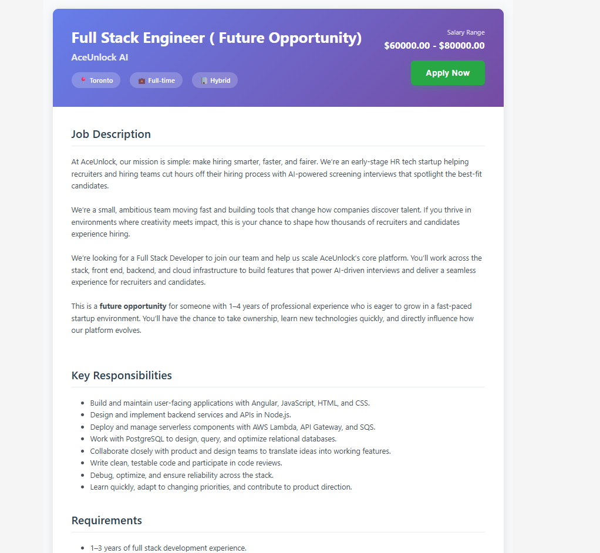
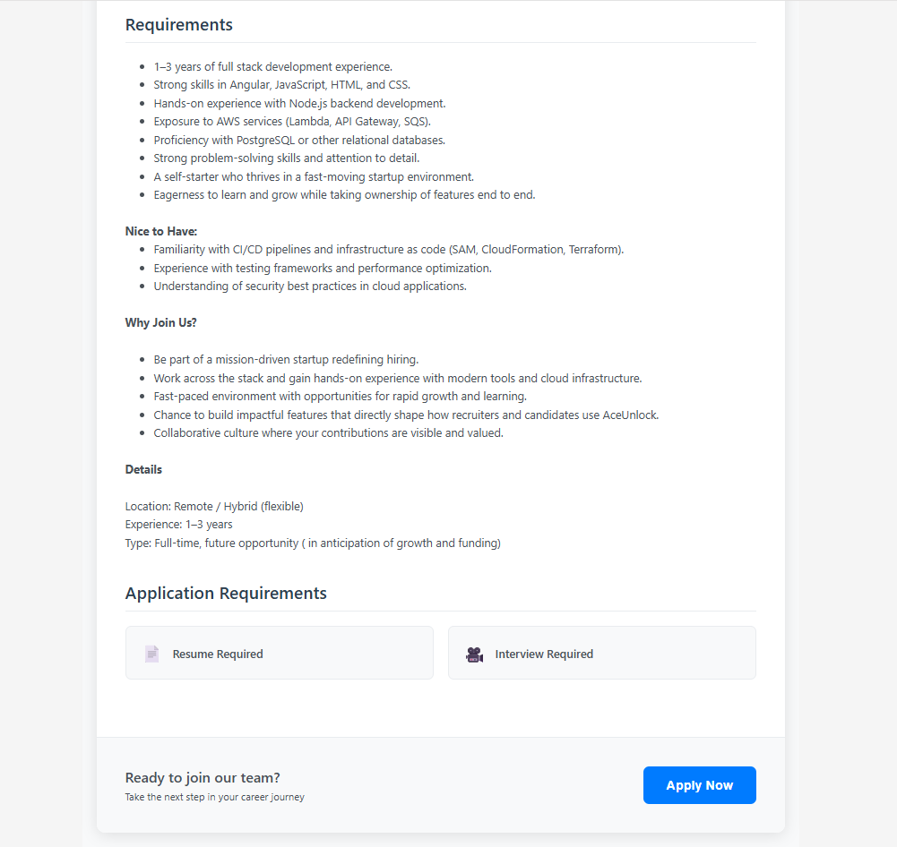
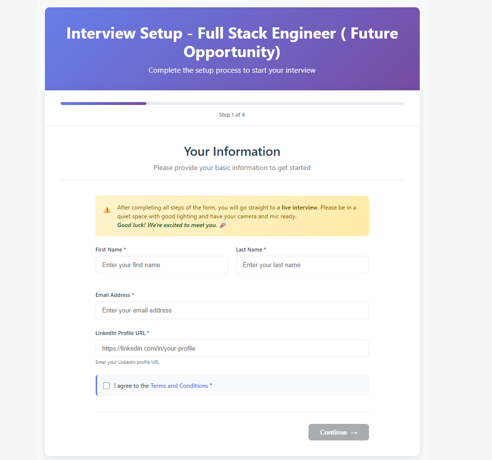
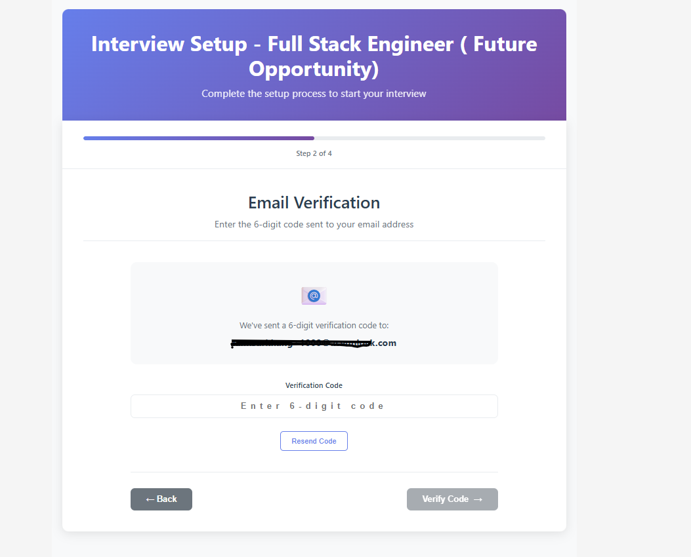
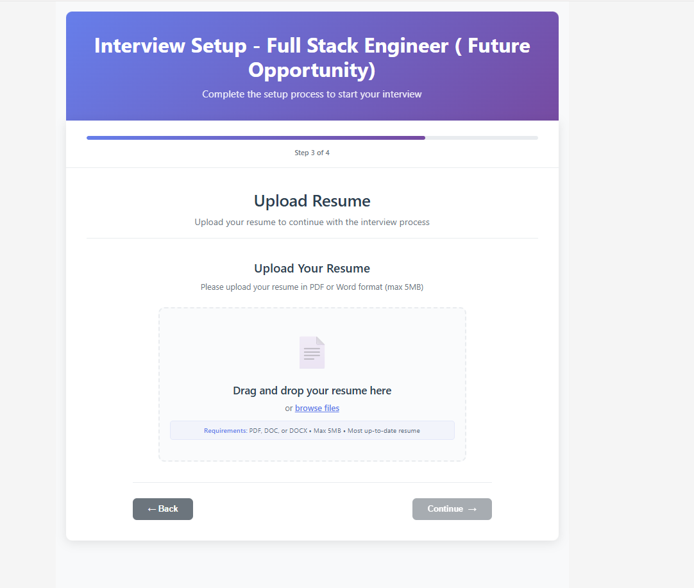
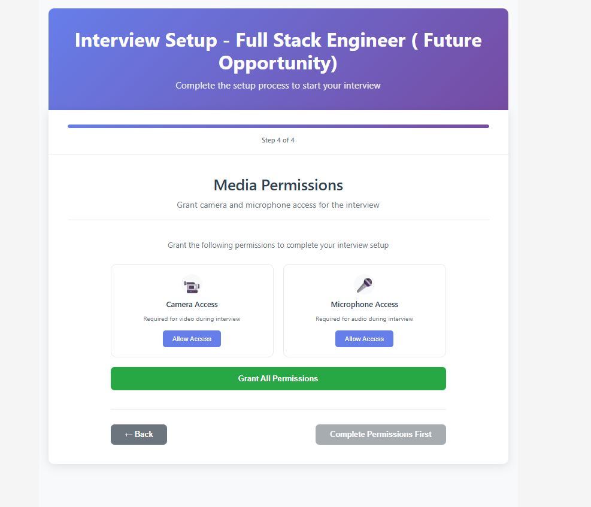
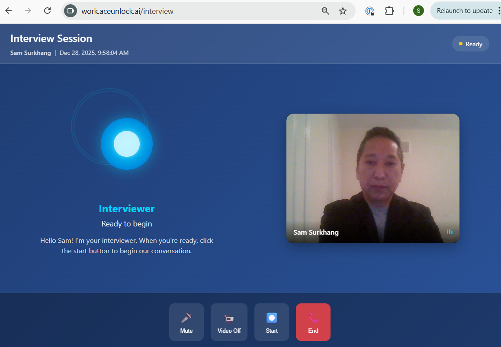
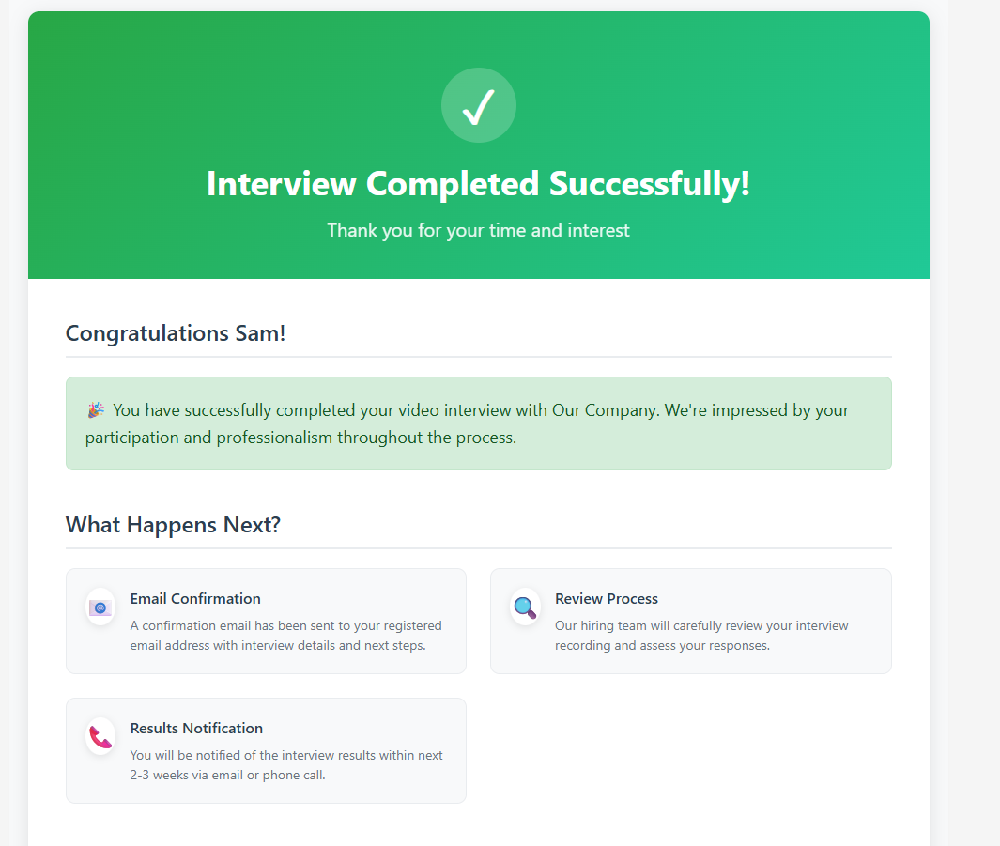

# Application & Interview Process

This guide walks you through the complete application and interview process, from viewing the job posting to receiving your confirmation email.

## Overview

The application process is a streamlined wizard that gets you from job posting to interview in minutes:

1. **View Job Posting** - Read about the role and click "Apply"
2. **Upload Resume** - Provide your resume **(only if required by employer)**
3. **Email Verification** - Enter your email to receive a verification code
4. **Enter Code** - Verify your email with the 6-digit code
5. **Pre-Interview Setup** - Choose your camera and microphone, test your setup
6. **Interview Room** - Complete your video interview with the AI
7. **Confirmation** - Interview submitted and next steps

**Total time**: 5-10 minutes for application + 15-30 minutes for interview

**Note**: The resume upload step only appears if the employer requires it for this position.

---

## Step 1: View Job Posting

This is what you see when you first access the job posting.

### What You'll See

The top of the job posting shows:
- **Company Name** - Who's hiring
- **Job Title** - The position you're applying for
- **Location** - Where the job is based (or if remote)
- **Job Description** - Overview of the role

As you scroll down, you'll see:
- **Detailed Requirements** - Skills and qualifications needed
- **Responsibilities** - What you'll be doing in the role
- **Additional Information** - Benefits, work environment, etc.
- **"Apply" Button** - Start your application

### What to Do

1. **Read the entire job description carefully** - Make sure you understand the role and requirements
2. **Note any specific requirements** - Resume upload, availability, certifications
3. **Check if resume is required** - Look for any mention of document requirements
4. **Prepare your resume** (if needed) - Have PDF or Word format ready
5. **Click "Apply"** when ready to proceed

### Tips

- 📋 Have your resume ready (PDF or Word format) in case it's required
- 📝 Note any questions you want to ask the AI during the interview
- ⏰ Make sure you have 30-45 minutes available (application + interview)
- 💡 Review the requirements and think of examples from your experience

---

## Step 2: Upload Resume (If Required)

**Important**: This step **only appears if the employer requires a resume** for this position. If you don't see a resume upload screen, the employer has made it optional or not required, and you'll proceed directly to email verification.

### What You'll See (If Resume is Required)

- Upload area for your resume
- Supported file formats (PDF, DOC, DOCX)
- File size limit (usually 5-10 MB)
- "Next" button to continue

### What to Do

1. **Click "Choose File"** or drag and drop your resume
2. **Wait for upload confirmation** (green checkmark or success message)
3. **Click "Next"** to continue to email verification

### Supported Formats

- ✅ PDF (.pdf) - **Recommended** (best compatibility)
- ✅ Word (.doc, .docx)
- ❌ Images (JPG, PNG) - Not supported
- ❌ Plain text (.txt) - Not supported

### File Requirements

- **Maximum size**: 10 MB
- **File name**: Can be anything, but avoid special characters
- **Content**: Ensure your resume is current and accurate

### Troubleshooting

**"File too large" error**:
- Compress your PDF (use online PDF compressor)
- Save Word document without embedded images
- Remove unnecessary graphics

**Upload fails**:
- Check your internet connection
- Try a different browser (Chrome recommended)
- Ensure file is not corrupted (try opening it first)
- Contact support: support@aceunlock.com

---

## Step 3: Email Verification (Pre-Interview Step 1)

After uploading your resume (or skipping if not required), you'll enter the pre-interview setup process.

### What You'll See

- **Email address input field**
- **"Send Code" or "Continue" button**
- Privacy notice about your data
- Progress indicator showing you're on Step 1

### What to Do

1. **Enter your email address** - Use an email you check regularly
2. **Click "Send Code"** or **"Continue"**
3. **Check your inbox** - Code arrives within 1-2 minutes

### Important

- ✅ Use a **valid email address** - You'll receive:
  - Verification code (immediately)
  - Interview confirmation email (after completion)
  - Updates about your application status
- ✅ Double-check spelling - Ensure email is correct
- 📧 Check spam folder - If code doesn't arrive in 2 minutes
- 🔄 Can resend code - Option available on next screen

### What the Email Contains

**Subject**: Your AceUnlock Interview Verification Code

**Body**:
- 6-digit verification code (e.g., 123456)
- Expiration time (usually 15 minutes)
- Company name and job title
- Instructions

### Troubleshooting

**Didn't receive the code?**
1. Wait 2-3 minutes (email may be delayed)
2. Check spam/junk/promotions folder
3. Verify you typed email correctly
4. On next screen, click "Resend Code"
5. Try a different email address
6. Contact support: support@aceunlock.com

---

## Step 4: Enter Verification Code (Pre-Interview Step 2)

After requesting the code, you'll see the verification screen.

### What You'll See

- **6-digit code entry field** (or 6 separate input boxes)
- **"Verify" or "Continue" button**
- **"Resend Code" option** if you didn't receive it
- Progress indicator showing Step 2

### What to Do

1. **Open the verification email** (check inbox from Step 3)
2. **Copy the 6-digit code** (e.g., 123456)
3. **Paste or type the code** into the input field
4. **Click "Verify"** or **"Continue"**

### Important

- ⏰ Code expires in **15 minutes** - Use it promptly
- 🔢 Enter exactly as shown - Usually 6 digits, no spaces
- 🔄 Can request new code - Click "Resend Code" if needed
- ✅ Auto-advances - May proceed automatically when all 6 digits entered

### What Happens Next

Once verified:
- ✅ Your email is confirmed
- ✅ Your application profile is created
- ✅ You proceed to camera/microphone setup

### Troubleshooting

**"Invalid code" error**:
- Check you entered all 6 digits correctly
- Ensure no extra spaces
- Code is usually numbers only
- Make sure code hasn't expired (15 minutes)
- Request a new code if needed

**"Code expired" error**:
- Click "Resend Code"
- Check email for new 6-digit code
- Enter new code within 15 minutes

**Still not working?**
- Refresh the page and try again
- Try a different browser
- Contact support: support@aceunlock.com

---

## Step 5: Camera & Microphone Setup (Pre-Interview Step 3)

Now you'll set up your camera and microphone for the interview.

### What You'll See

- **Camera preview window** - Live view from your camera
- **Microphone selector** - Dropdown to choose which mic to use
- **Camera selector** - Dropdown to choose camera (if multiple available)
- **Permission prompts** - Browser asking for camera/microphone access
- **"Next" or "Continue" button**
- Progress indicator showing Step 3

### What to Do

1. **Click "Allow" when browser asks for camera permission**
2. **Click "Allow" when browser asks for microphone permission**
3. **Check your camera preview** - Make sure you're visible and centered
4. **Select your preferred microphone** from dropdown (if multiple)
5. **Select your preferred camera** from dropdown (if multiple)
6. **Adjust your position and lighting** as needed
7. **Click "Next"** or **"Continue"** when ready

### Camera Setup Tips

✅ **Position**:
- Camera at eye level or slightly above
- Center yourself in frame
- Leave a little space above your head
- Shoulders and head visible

✅ **Lighting**:
- Face a window or light source (light in front of you)
- Avoid backlighting (light behind you makes you dark)
- Turn on room lights if needed
- Even, soft lighting works best

✅ **Background**:
- Clean and uncluttered
- Professional setting (avoid beds, messy rooms)
- Neutral wall or home office
- No distractions (people walking by, TV)

### Microphone Setup Tips

✅ **Choose the right mic**:
- Built-in microphone works fine for most
- Headset/earbuds often provide better quality
- External USB microphone also good
- Avoid speakerphone (creates echo)

✅ **Environment**:
- Choose quiet location
- Close windows (reduces outside noise)
- Turn off TV, radio, fans
- Notify others you're interviewing

### Browser Permissions

**If prompted**:
- Browser will show "Allow [site] to use your camera?"
- Browser will show "Allow [site] to use your microphone?"
- **Click "Allow" for both**

**If you accidentally clicked "Block"**:
1. Look for camera icon in browser address bar
2. Click it and select "Allow"
3. Refresh the page

**Different browsers**:
- **Chrome**: Padlock icon → Site settings → Camera/Mic → Allow
- **Safari**: Safari menu → Preferences → Websites → Camera/Mic
- **Firefox**: Padlock icon → Permissions → Allow

## Step 6: Audio & Final Check (Pre-Interview Step 4)

Almost ready! This is your final check before entering the interview.

### What You'll See

- **Audio test section** - Record and play back your voice
- **Camera preview** - Final check of your video
- **Instructions** - Tips for the interview
- **"Start Interview" button** - Begin when ready
- Progress indicator showing Step 4 (final setup step)

### What to Do

1. **Test your audio**:
   - Click "Record" or "Test Audio"
   - Speak for 5-10 seconds (e.g., "Testing 1, 2, 3. This is my audio test.")
   - Click "Stop"
   - Click "Play" to hear yourself

2. **Listen to the playback**:
   - Is your voice clear?
   - Is volume at good level (not too quiet or too loud)?
   - Any background noise?

3. **Make final adjustments**:
   - Fix lighting if needed
   - Adjust camera angle
   - Move closer to mic if voice is quiet
   - Eliminate any background noise

4. **Read the instructions** - Quick tips displayed on screen

5. **Click "Start Interview"** when you're satisfied with setup

### What to Check

✅ **Video Quality**:
- You're clearly visible
- Good lighting (not too dark)
- Professional background
- Centered in frame

✅ **Audio Quality**:
- Voice is clear and understandable
- No echo or feedback
- No background noise (TV, traffic, conversations)
- Volume is good (not too quiet)

✅ **Environment**:
- Quiet location
- No interruptions expected
- Good internet connection
- Device charged or plugged in

✅ **Appearance**:
- Dressed professionally
- Groomed appropriately
- Ready to make good impression

### Final Preparation

Before clicking "Start Interview":

📝 **Mental prep**:
- Take a deep breath
- Relax and be yourself
- Remember: You can ask AI questions too!
- Think positive

💡 **Have ready**:
- Notes about the job (optional)
- Questions you want to ask
- Water nearby
- Resume (for reference)

⏰ **Time check**:
- Have 30-45 minutes available
- Won't be interrupted
- In a quiet space

### Technical Requirements

**Browser** (in case you need to switch): 
- ✅ Chrome (recommended)
- ✅ Safari
- ✅ Firefox
- ✅ Edge
- ❌ Internet Explorer (not supported)

**Internet**:
- Minimum: 2 Mbps upload speed
- Recommended: 5+ Mbps
- Test: speedtest.net (if unsure)

**Device**:
- Camera and microphone working
- Sufficient battery or plugged in
- Other apps closed

### Troubleshooting

**Audio playback has issues**:
- Voice too quiet: Move closer to microphone
- Echo/feedback: Use headphones/earbuds
- Background noise: Move to quieter location or close windows

**Video looks dark**:
- Turn on more lights
- Face toward a light source (window, lamp)
- Avoid having light behind you

**Still having technical issues?**
- Go back to previous step and re-select camera/mic
- Refresh the page and start setup again
- Try a different browser
- Contact support@aceunlock.com immediately

### Ready?

When everything looks and sounds good, click **"Start Interview"** to enter the interview room!

---

## Step 7: Interview Room

You're now in the interview room with the AI Interviewer!

### What You'll See

- **Your video feed** - See yourself on camera (usually in corner)
- **AI Interviewer interface** - Visual representation or status
- **Question being asked** - May appear as text while AI speaks
- **Interview progress** - Some indication of where you are
- **Controls** (may vary) - Help, volume, etc.

### What You'll See (Screen Elements)

The interview room typically shows:
- Your live video feed
- AI interviewer avatar or status
- Current question (may be displayed as text)
- Time elapsed (optional)
- Basic controls (volume, help)

### How the Interview Works

1. **AI asks a question via audio** - Listen carefully
2. **Question appears on screen** - You can read it too
3. **You answer on camera** - Speak naturally, looking at camera
4. **AI listens and may ask follow-ups** - Based on your response
5. **Process repeats** for multiple questions
6. **Interview automatically ends** when complete

### Interview Format

- **Adaptive questioning** - AI tailors questions to your background and responses
- **Follow-up questions** - AI asks for clarification or deeper detail when needed
- **Two-way conversation** - You can ask the AI questions too!
- **Natural flow** - Feels like a real conversation

### What the AI Can Ask About

- Your experience and background
- Scenario-based questions ("How would you handle...")
- Technical skills relevant to the role
- Behavioral questions ("Tell me about a time...")
- Role-specific situations
- Your motivations and career goals

### You Can Ask Questions Too!

Yes, you can ask the AI Interviewer questions during the interview:

**AI can answer**:
- Work hours, schedule, location
- Role details and responsibilities
- Hiring process and timeline
- Company culture (if information provided)
- Benefits overview (if available)

**AI will defer to HR**:
- Specific salary negotiations
- Complex policy questions
- Custom requests
- Questions requiring human judgment

**How it works**:
- Pause and say "I have a question"
- Ask your question clearly
- AI will answer if it has the information
- If not, it will note it for HR to follow up

### Tips for Success

✅ **Before answering**:
- Take 2-3 seconds to think
- You don't need to rush
- Organize your thoughts

✅ **While answering**:
- Look at the camera, not your screen
- Speak clearly at normal pace
- Use examples and specifics
- Be concise but thorough (2-3 minutes per answer)

✅ **Body language**:
- Sit up straight
- Smile naturally
- Use hand gestures (moderately)
- Show enthusiasm and energy

✅ **Content tips**:
- Use the STAR method (Situation, Task, Action, Result)
- Provide specific examples
- Quantify achievements when possible
- Be honest and authentic
- Ask clarifying questions if needed

### What to Avoid

❌ **Don't**:
- Read from a script (AI can detect this)
- Give one-word answers
- Ramble for 10+ minutes per question
- Look at your phone or get distracted
- Speak negatively about past employers
- Interrupt or speak over the AI

### During the Interview

**If you need to pause**:
- Most interviews allow brief pauses between questions
- Take a sip of water
- Collect your thoughts
- **Do not** exit the browser or close the tab

**If technical issues occur**:
- If camera/mic stops working, refresh the page
- Your progress is usually saved
- Contact support immediately if issues persist

**Interview length**:
- Typically 15-30 minutes total
- Depends on the role and your responses
- AI may ask more follow-ups if your answers are detailed

### What Happens Behind the Scenes

While you're interviewing:
- ✅ Your video is being recorded
- ✅ Audio is being transcribed
- ✅ AI is analyzing your responses
- ✅ Everything is encrypted and secure

---

## Step 8: Interview Complete & Confirmation

Congratulations! You've completed your interview.

### What You'll See

- **"Interview Completed" or "Thank You" message**
- **Confirmation that your interview was submitted**
- **Next steps information** - What happens now
- **Timeline** - When you can expect to hear back
- **Confirmation number** or reference (optional)
- **Contact information** - Who to reach if you have questions

### What Happens Next

**Immediately**:
1. ✅ Your interview is saved automatically
2. 📧 Confirmation email sent to you
3. 🎥 Video and transcript sent to hiring team

**Within 24-48 hours**:
- 🤖 AI Evaluator scores your interview
- 👥 Hiring team reviews your interview
- 📊 You appear on their Interview Dashboard

**Within 1-2 weeks** (typical):
- 📩 Company contacts top candidates
- 📞 May invite you for next round interview
- ✉️ Or sends update on your application status

### Confirmation Email

You'll receive an email with:
- ✅ Confirmation that interview was received
- 📋 Job title and company name
- 🔢 Confirmation/reference number
- 📅 Expected timeline for next steps
- 📧 Contact information if you have questions

**Save this email** for your records.

### What to Do While Waiting

✅ **Be patient**:
- Companies typically review within **1-3 weeks**
- You will receive an email notification regardless of the outcome
- All candidates are notified whether selected or not
- Don't worry if you don't hear back immediately

✅ **Continue job search**:
- Don't put all eggs in one basket
- Apply to other opportunities
- Keep practicing your interview skills

✅ **Check your email regularly**:
- Watch for updates from the company
- Check spam folder just in case
- Status updates sent automatically

### Checking Your Status

**You will be notified automatically**:
- ✅ All candidates receive email updates
- ✅ Whether you're moving forward or not
- ✅ Timeline: 1-3 weeks typically
- ✅ No need to follow up or check status

**What to expect**:
- Email notification with your application status
- If selected: Invitation for next steps (phone screen, in-person interview)
- If not selected: Notification thanking you for your time

**If you have questions**:
- Contact information should be in your confirmation email
- Or email support@aceunlock.com who can connect you with the company

### Communication Timeline

**What to expect**:
- ⏰ **1-3 weeks** - Typical response time
- 📧 **Automatic notifications** - You will hear back regardless of outcome
- ✅ **No follow-up needed** - The system notifies all candidates
- 📬 **Check email** - Including spam folder

**If you don't hear back after 3 weeks**:
- Check your spam/junk folder
- Email the contact from your confirmation email
- Or contact support@aceunlock.com for assistance

**Note**: You do NOT need to send follow-up emails. All candidates are automatically notified of their status.

---

## Frequently Asked Questions

### Can I redo my interview if I made a mistake?

Generally, no. Interviews are one-time to ensure fairness. However, if you experienced significant technical issues, contact support immediately: support@aceunlock.com

### How long does the company take to review?

**Timeline**: 1-3 weeks typically. All candidates receive automatic email notifications with their status, regardless of the outcome. You don't need to follow up - the system will notify you.

### Can I see my interview recording?

You can request a copy of your interview data by emailing support@aceunlock.com or contacting the company directly.

### What if I didn't answer a question well?

Don't worry! The AI evaluates your overall performance across all questions. One weak answer won't disqualify you.

### Will a human watch my interview?

Yes. While AI provides an initial evaluation, human recruiters and hiring managers review interviews of top candidates.

### Can I delete my interview?

You can request deletion by contacting the company or support@aceunlock.com. Data can be deleted per your privacy rights.

### What if I have accessibility needs?

Contact the company or support@aceunlock.com before your interview to discuss accommodations.

---

## Need Help?

### Technical Support
- 📧 Email: support@aceunlock.com
- 💬 Response time: Within 24 hours

### About the Job/Company
- Contact the recruiter or hiring manager who invited you
- Check the job posting for company contact information

### Privacy Questions
- Email: support@aceunlock.com
- Subject: "Privacy Request - [Your Name]"

---

**Good luck with your interview!** 🎉 Remember: be yourself, be prepared, and showcase your skills confidently.

