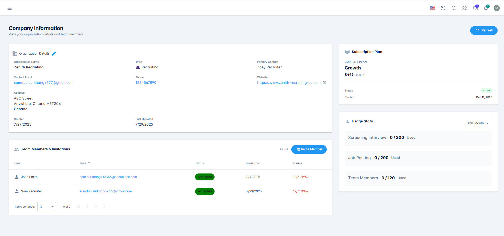
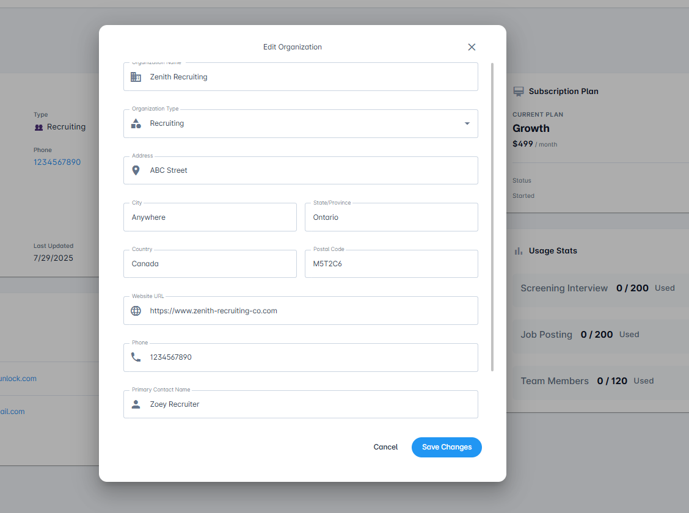
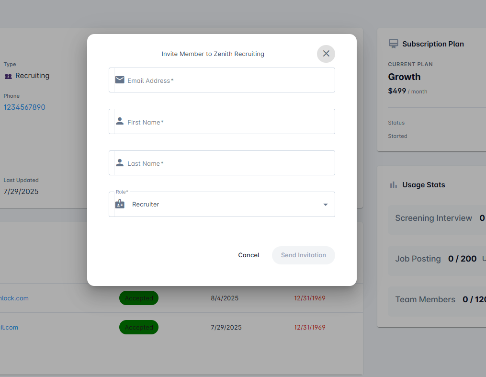

# Company Management

The Company Management page is your central hub for managing your organization's information, subscription plan, team members, and plan utilization on AceUnlock.

## Overview

The Company Management dashboard provides comprehensive control over your organization's AceUnlock account, including:

- **Organization Details**: Manage company information and contact details
- **Team Members**: Invite and manage users with role-based access
- **Subscription Plan**: View current plan details and billing information
- **Usage Statistics**: Track your monthly plan utilization and interview quota

## Organization Details

### View Company Information

This section displays your company's profile information, including:

- Company name
- Company type/industry
- Email address
- Phone number
- Physical address
- Other contact information

### Edit Company Information

To update your organization details:

1. Locate the **Organization Details** section
2. Click the **Edit icon** (pencil icon) next to "Organization Details"
3. A dialog window titled "Edit Organization" will open with editable fields
4. Update any of the following:
   - **Organization Name**: Your company name
   - **Organization Type**: Business category (e.g., Recruiting)
   - **Address**: Street address
   - **City**: City name
   - **State/Province**: State or province
   - **Country**: Country name
   - **Postal Code**: ZIP or postal code
   - **Website URL**: Company website
   - **Phone**: Contact phone number
   - **Primary Contact Name**: Main contact person
5. Click **"Save Changes"** to apply your updates, or **"Cancel"** to discard

**Note**: Changes to company information are immediately reflected across your AceUnlock account and may appear in candidate-facing materials.

## Team Members & Invitation

### Team Members Overview

The Team Members section displays a comprehensive table of all users who have access to your AceUnlock site.

**Important**: Based on your subscription plan, there may be limitations on the number of team members who can access the platform:
- **Growth Plan**: Up to 2 team members
- **Business Plan**: Up to 5 team members
- **Enterprise Plan**: Unlimited team members

### Team Member Table

The table shows:
- **Name**: Team member's full name with avatar
- **Email**: User's email address (sortable)
- **Status**: Current invitation or account status
  - *Accepted*: User has joined and can access the platform (shown in green)
  - *Invited*: Invitation sent, awaiting acceptance
- **Invited On**: Date the invitation was sent
- **Expires**: Expiration date of the invitation
- **Actions**: Options to manage or remove team members

The table header displays "2 total" showing the current number of team members in the organization.

### Invite New Team Members

To add additional team members to your organization:

1. Click the **"Invite Member"** button in the Team Members section
2. A dialog box titled "Invite Member to [Your Organization]" will open with the following fields:
   - **Email Address*** (required): Work email of the team member
   - **First Name*** (required): Team member's first name
   - **Last Name*** (required): Team member's last name
   - **Role*** (required): Select user permission level (Recruiter or Admin)
3. Click **"Send Invitation"** to send the invite, or **"Cancel"** to close the dialog

### User Roles

AceUnlock supports two user roles:

#### Admin
- Full access to all features and settings
- Can manage team members and invitations
- Can view and modify subscription and billing
- Can edit company information
- Can create, edit, and delete job postings
- Can manage evaluation rubrics and questions
- Can view all candidates and interviews

#### Recruiter
- Can create and manage job postings
- Can view and evaluate candidates
- Can manage interview schedules
- Can customize email templates
- Cannot modify company settings
- Cannot manage team members
- Cannot access billing or subscription information

### Invitation Process

1. **Invitation Sent**: After clicking "Send Invitation," an email is sent to the specified address
2. **Status: Invited**: The team member appears in the table with "Invited" status
3. **User Accepts**: The recipient clicks the invitation link and completes sign-up
4. **Status: Accepted**: Once the user joins, their status changes to "Accepted" and they gain access to the platform

**Invitation Tips**:
- Invitations are typically valid for 7 days
- Users can sign up using Google or email/password
- Invited users will have immediate access based on their assigned role

## Subscription Plan

### Current Plan Information

The Subscription Plan section displays:

- **Current Plan**: Plan name badge (e.g., "Growth")
- **Monthly Cost**: Your current subscription fee (e.g., "$499 / month")
- **Status**: Current subscription status (e.g., "ACTIVE" in green badge)
- **Started**: Date when the subscription began (e.g., "Dec 11, 2025")
- **Plan Details**: Key features and limitations of your plan

As shown in the dashboard, the Subscription Plan widget appears in the upper right corner of the Company Information page.

### Plan Features

Your current plan details include:
- Number of roles you can interview for
- Monthly candidate interview quota
- Number of team members allowed
- Available integrations and features
- Support level

### Changing Your Plan

To upgrade or modify your subscription plan:

1. **Contact Support**: Email support@aceunlock.com with your request
2. **Include Details**:
   - Current plan name
   - Desired plan
   - Reason for change (optional)
   - Preferred effective date
3. **Await Response**: Support team will assist with plan changes and billing adjustments

**Coming Soon**: In a future version, administrators will have the ability to update their subscription plan directly from the dashboard.

### Plan Comparison

Need to change your plan? Review the available options:

- **Growth** ($499/month): 2 roles, 200 candidates, 2 team members
- **Business** ($999/month): 5 roles, 500 candidates, 5 team members
- **Enterprise** (Custom): Unlimited roles, unlimited candidates, unlimited team members

Visit the [AceUnlock Pricing Page](https://www.aceunlock.com/pricing) for complete plan details.

## Usage Statistics

### Monthly Utilization Tracking

The Usage Stats section provides real-time insights into your plan consumption for the current billing month. This widget appears on the right side of the Company Information page with a dropdown to select "This Month".

**Tracked Metrics**:

1. **Screening Interview**: 
   - Shows interviews conducted vs. quota (e.g., "0 / 200 Used")
   - Tracks all AI-conducted candidate interviews

2. **Job Posting**: 
   - Shows active job postings vs. quota (e.g., "0 / 200 Used")
   - Monitors the number of active job roles

3. **Team Members**: 
   - Shows current team members vs. maximum allowed (e.g., "0 / 120 Used")
   - Displays utilized team member slots out of total available

Each metric shows a clear format: `[Used] / [Total Quota] Used`

### Over-Quota Usage

**Important Billing Information**:

- The system **will not prevent** you from exceeding your monthly interview quota
- Conducting interviews over your plan limit incurs additional charges
- **Overage Fee**: $5 per interview conducted beyond your monthly quota
- Overage charges are added to your next monthly invoice

**Example**:
- Your plan includes 200 interviews/month
- You conduct 225 interviews in a month
- You'll be charged an additional $125 (25 interviews × $5) on your next bill

### Monitoring Best Practices

To avoid unexpected overage charges:

1. **Check Usage Regularly**: Monitor your usage statistics throughout the month
2. **Plan Ahead**: If you anticipate higher volume, consider upgrading your plan
3. **Set Alerts**: Contact support to set up usage alerts
4. **Upgrade Proactively**: Switch to a higher tier before reaching your limit

## Best Practices

### Organization Management

- **Keep Information Current**: Regularly update company details to ensure accurate candidate communications
- **Use Work Emails**: Always use professional email addresses for team members
- **Review Permissions**: Periodically audit team member roles and access levels
- **Remove Inactive Users**: Promptly remove team members who no longer need access

### Team Collaboration

- **Assign Appropriate Roles**: Give Admin access only to those who need full control
- **Onboard New Members**: Provide training and documentation to new team members
- **Communicate Changes**: Notify your team of any company setting updates that affect workflows

### Subscription Optimization

- **Monitor Usage Trends**: Track monthly patterns to determine if your plan is right-sized
- **Plan Seasonally**: Consider temporary upgrades during high-volume recruitment periods
- **Leverage Annual Billing**: Save 20% by switching to yearly billing (contact support)

### Cost Management

- **Set Internal Limits**: Establish guidelines to prevent quota overages
- **Forecast Needs**: Project interview volume based on hiring plans
- **Optimize Scheduling**: Spread interviews throughout the month to manage load

## Troubleshooting

### Cannot Edit Company Information

**Issue**: Edit button is grayed out or not visible

**Solution**:
- Verify you're logged in as an Admin user
- Recruiters cannot edit company information
- Contact an Admin user to make changes

### Team Member Invitation Not Received

**Issue**: Invited user didn't receive the invitation email

**Solution**:
- Check the email address for typos
- Ask the recipient to check spam/junk folder
- Wait up to 1 hour for email delivery
- Resend the invitation if needed
- Contact support@aceunlock.com if issue persists

### Reached Team Member Limit

**Issue**: Cannot invite additional team members

**Solution**:
- Check your current plan's team member limit
- Remove inactive team members to free up slots
- Upgrade to a higher plan for more seats
- Contact support@aceunlock.com to discuss Enterprise options

### Usage Statistics Not Updating

**Issue**: Usage stats appear outdated or incorrect

**Solution**:
- Refresh the page (usage updates in real-time)
- Check if you're viewing the correct billing period
- Clear browser cache and reload
- Contact support if data remains inaccurate

## Need Help?

Can't find what you're looking for?
- Search our [FAQ](../faq/README.md)
- Contact support at support@aceunlock.com
- Visit the [AceUnlock Pricing Page](https://www.aceunlock.com/pricing) for plan details