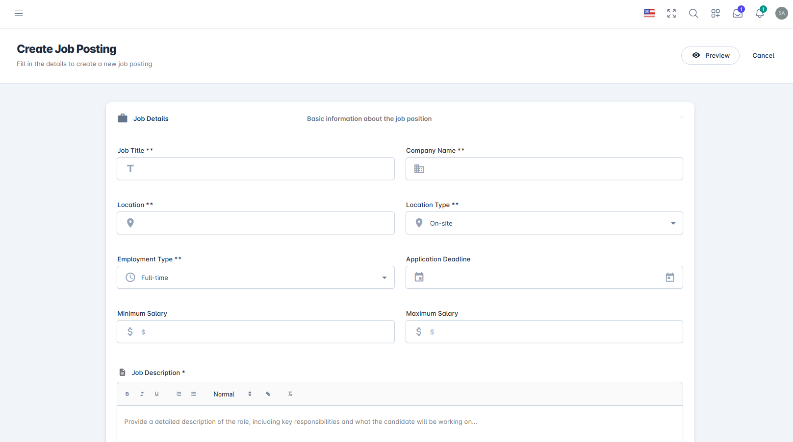
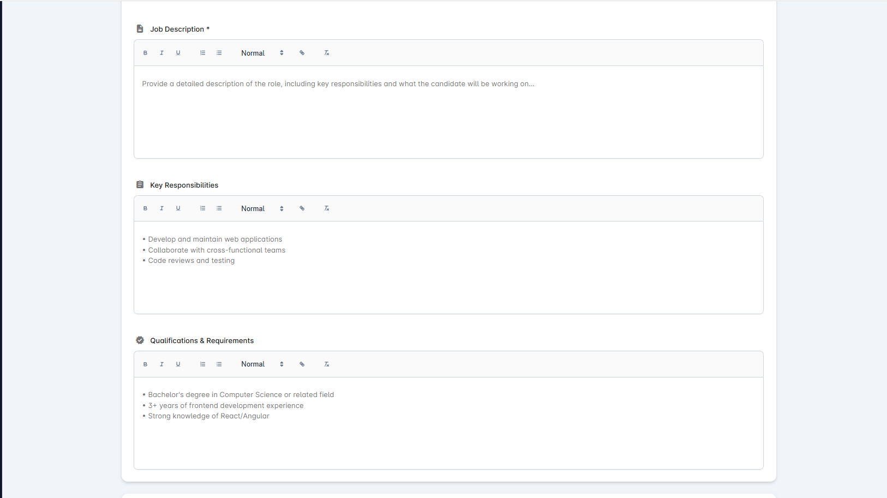
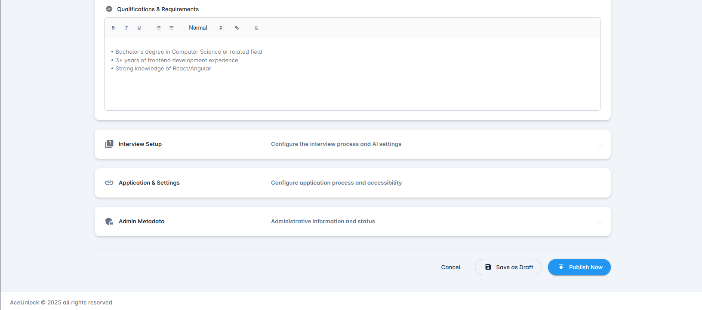
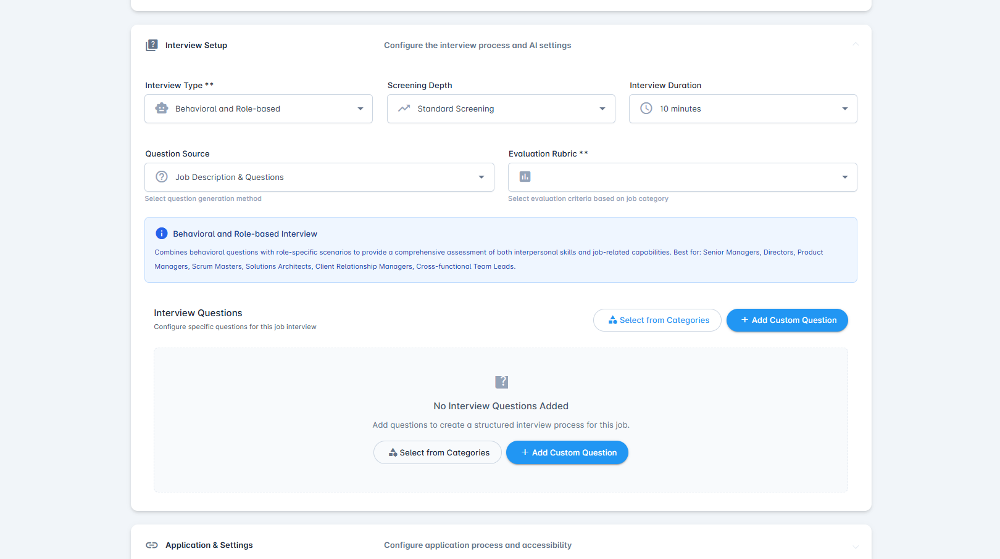
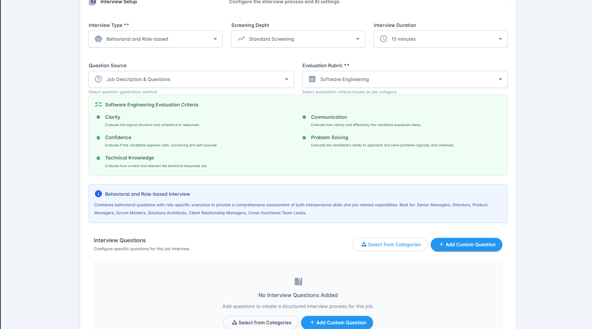
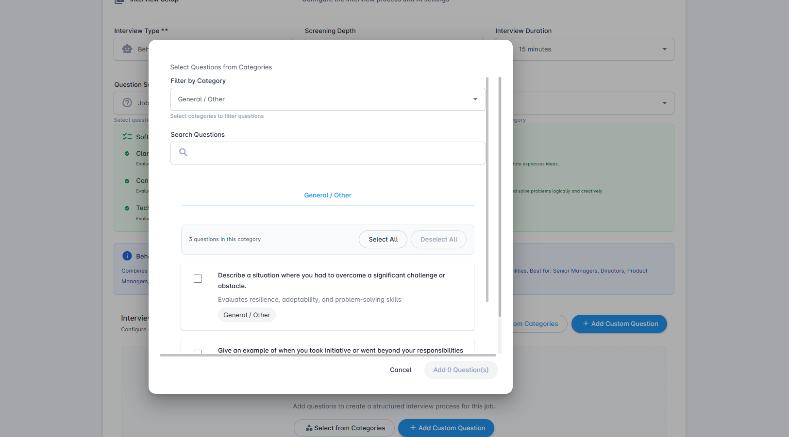

# Create New Job Posting

Complete guide to creating job postings with full control over every detail and configuration option.

## Overview

The **Create New Job** feature provides comprehensive control over every aspect of your job posting and interview setup. Unlike Quick Create, which uses AI to automate the process, Create New Job gives you granular control over:

- Detailed job information and requirements
- Custom interview configurations
- Question and rubric assignments
- Email template selection
- Application workflow settings
- Advanced scheduling and deadline options

This feature is ideal for positions that require specialized interview processes, custom evaluation criteria, or unique application workflows.

## When to Use Create New Job vs. Quick Create

### Use Create New Job When:
- You need complete control over interview settings
- The position requires custom evaluation rubrics
- You want to attach specific interview questions from the start
- You need to configure advanced application workflows
- The role has unique requirements not suited for default settings
- You're setting up a complex multi-stage interview process

### Use Quick Create When:
- You have a job description ready to paste
- You need to create a posting quickly
- Standard interview settings work for your needs
- You can refine details after initial creation

## Prerequisites

Before creating a new job posting, ensure you have:
- An active AceUnlock account with recruiter or administrator privileges
- Company profile configured in your organization settings
- (Optional) Custom interview questions prepared
- (Optional) Evaluation rubrics created
- (Optional) Email templates ready for candidate communication

## Getting Started

### Step 1: Access Create New Job

1. Navigate to the **Job Postings** dashboard
2. Click the **Create New Job** button (blue button in the top-right corner)
3. A comprehensive job creation page will open with the header "Create Job Posting"
4. You'll see "Fill in the details to create a new job posting" as the subtitle
5. A **Preview** button is available in the top-right to view how the job posting will appear to candidates

The form is organized into expandable sections that guide you through the job posting creation process.

## Job Posting Form Sections

The Create Job Posting form consists of the following main sections:

1. **Job Details** - Basic information about the job position
2. **Interview Setup** - Configure the interview process and AI settings
3. **Application & Settings** - Configure application process and accessibility
4. **Admin Metadata** - Administrative information and status

### Section 1: Job Details

This section captures all the fundamental information about the position and is divided into three parts.

**Basic information about the job position**

**Required Fields:**

- **Job Title** (marked with **): The official title of the position
  - Examples: "Senior React Developer," "Marketing Manager," "Data Scientist"
  - Be specific and clear to attract the right candidates

- **Company Name** (marked with **): Your organization name
  - Auto-filled from your company profile
  - Ensures consistent branding across all job postings

- **Location** (marked with **): Where the job is based
  - Enter city and state/province
  - Examples: "Toronto, ON," "New York, NY," "San Francisco, CA"

- **Location Type** (marked with **): Select from dropdown
  - On-site
  - Remote
  - Hybrid
  - Helps candidates understand work arrangement expectations

- **Employment Type** (marked with **): Select from dropdown
  - Full-time
  - Part-time
  - Contract
  - Internship

- **Application Deadline**: Set the last date for candidates to apply
  - Uses a date picker for easy selection
  - Posting automatically closes after this date

**Optional Fields:**

- **Minimum Salary**: The lower end of the compensation range
  - Dollar sign ($) prefix included
  - Can be left blank if you prefer not to display salary

- **Maximum Salary**: The upper end of the compensation range
  - Dollar sign ($) prefix included
  - Helps set candidate expectations

**Job Description and Content**

The second part of Job Details includes rich text editors for describing the role in detail.

**Job Description** (marked with *): 
- Use the rich text editor with formatting toolbar
- Toolbar includes: Bold (B), Italic (I), Underline (U), Bulleted list, Numbered list, Style dropdown (Normal), and text formatting options
- Placeholder text: "Provide a detailed description of the role, including key responsibilities and what the candidate will be working on..."
- Include an engaging overview of the role
- Detail day-to-day activities and expectations
- Describe the team and company culture
- Highlight growth opportunities and career development

**Key Responsibilities**:
- Rich text editor with full formatting toolbar
- Use bullet points to list primary duties
- Be specific about what the role entails
- Example format:
  - Develop and maintain web applications
  - Collaborate with cross-functional teams
  - Code reviews and testing

**Qualifications & Requirements**:
- Rich text editor with formatting options
- List required qualifications and experience
- Specify years of experience needed
- Detail technical skills and tools required
- Include soft skills and competencies
- Note any certifications or education requirements
- Example format:
  - Bachelor's degree in Computer Science or related field
  - 3+ years of frontend development experience
  - Strong knowledge of React/Angular

**Best Practice:** Create detailed, realistic descriptions. The AI interviewer will use this information to generate relevant interview questions.

**Expandable Sections Overview**

After completing the Job Details section, you'll see three expandable accordion sections at the bottom:

1. **Interview Setup** - "Configure the interview process and AI settings"
2. **Application & Settings** - "Configure application process and accessibility"
3. **Admin Metadata** - "Administrative information and status"

Each section can be clicked to expand and configure additional settings.

### Section 2: Interview Setup

Click on the **Interview Setup** accordion to expand this section and configure how the AI interview will be conducted.

**Configure the interview process and AI settings**

**Interview Configuration Fields:**

**Interview Type** (marked with **): Select from dropdown
- **Behavioral and Role-based**: Combines behavioral questions with role-specific scenarios to provide comprehensive assessment of both interpersonal skills and job-related capabilities. Best for: Senior Managers, Directors, Product Managers, Scrum Masters, Solutions Architects, Client Relationship Managers, Cross-functional Team Leads.

When selected, you'll see an information box describing the interview type in detail.

**Screening Depth**: Select from dropdown
- **Standard Screening**: Default screening level
- Other depth options available depending on your needs

**Interview Duration**: Select from dropdown
- 10 minutes
- 15 minutes
- 20 minutes
- 30 minutes
- 45 minutes
- 60 minutes

Choose based on role complexity and number of topics to cover.

**Question Source**: Select from dropdown
- **Job Description & Questions**: AI generates questions based on the job description and any custom questions you add
- Determines how the AI interviewer creates interview questions

**Evaluation Rubric** (marked with **): Select from dropdown
- Choose evaluation criteria based on job category
- Example: "Software Engineering" for technical roles
- When selected, displays the evaluation criteria

**Evaluation Rubric Display**

When you select an Evaluation Rubric (e.g., "Software Engineering"), a green informational box appears showing the **Software Engineering Evaluation Criteria**:

✓ **Clarity**
- Evaluate the logical structure and coherence in responses

✓ **Communication**
- Evaluate how clearly and effectively the candidate expresses ideas

✓ **Confidence**
- Evaluate if the candidate appears calm, convincing and self-assured

✓ **Problem Solving**
- Evaluate the candidate's ability to approach and solve problems logically and creatively

✓ **Technical Knowledge**
- Evaluate how correct and relevant the technical responses are

These criteria will be used by the AI to evaluate candidate responses during the interview.

**Interview Type Information Box**

Below the rubric, you'll see a blue information box describing the selected Interview Type:

ℹ️ **Behavioral and Role-based Interview**

"Combines behavioral questions with role-specific scenarios to provide a comprehensive assessment of both interpersonal skills and job-related capabilities. Best for: Senior Managers, Directors, Product Managers, Scrum Masters, Solutions Architects, Client Relationship Managers, Cross-functional Team Leads."

This helps you understand which interview type is best suited for your position.

**Interview Questions Section**

**Interview Questions**
*Configure specific questions for this job interview*

By default, the section shows:
📋 **No Interview Questions Added**
"Add questions to create a structured interview process for this job."

You have two options for adding questions:

1. **Select from Categories** button - Choose from pre-built question banks organized by category
2. **+ Add Custom Question** button (blue) - Create a new custom question specific to this job

**Why attach questions?**
- Ensure consistency across all candidate interviews
- Ask must-have screening questions
- Cover specific topics important to your organization
- Create a structured interview process

**Option 1: Add Custom Question**

Clicking **+ Add Custom Question** opens a dialog with:

**Add Custom Question**

**Question Details**
*Enter the interview question and its purpose*

- **Question Text** (marked with **): Required field
  - Text area for entering your interview question
  - Validation: "Question text is required" if left empty

- **Description** (marked with **): Required field
  - Text area for explaining the purpose
  - Placeholder: "Explain what skills, traits, or knowledge this question evaluates"

**Categories & Classification**
*Classify this question for better organization*

- **Job Categories**: Dropdown field
  - Placeholder: "Select relevant job categories (optional)"
  - Helps organize questions by role type

Action buttons:
- **Cancel** - Close dialog without saving
- **Add Question** - Save the custom question (disabled until required fields are filled)

**Option 2: Select from Categories**

Clicking **Select from Categories** opens a dialog with:

**Select Questions from Categories**

**Filter by Category**: Dropdown to select question category
- Example: "General / Other"
- Helps narrow down questions by type

**Search Questions**: Search box to find specific questions
- Quickly filter questions by keywords

**Question List Display:**

Shows available questions organized by category (e.g., "General / Other")
- "3 questions in this category" counter
- **Select All** / **Deselect All** buttons for bulk selection

Each question is displayed with:
- ☐ Checkbox for selection
- Question text (e.g., "Describe a situation where you had to overcome a significant challenge or obstacle.")
- Brief description of what it evaluates (e.g., "Evaluates resilience, adaptability, and problem-solving skills")
- Category tag (e.g., "General / Other")

Action buttons:
- **Cancel** - Close dialog without adding questions
- **Add 0 Question(s)** - Add selected questions (number updates based on selections)

**Related Documentation:**
- [Interview Questions Guide](./question.md) - Learn more about creating and managing questions
- [Rubrics Management](./rubrics.md) - Understanding evaluation criteria

### Section 3: Application & Settings

Click on the **Application & Settings** accordion to expand configuration options for the application process.

**Configure application process and accessibility**

**Job Identification:**

- **Job ID**: Auto-generated unique identifier
  - Example: "JOB-1766792161726-U0PZQ"
  - Description: "Auto-generated unique identifier"
  - System-generated, cannot be edited
  - Used for tracking and internal references

**Application Limits:**

- **Maximum Applicants**: Optional field
  - Icon showing multiple people
  - Description: "Leave empty for unlimited"
  - Set a cap on the number of applications if needed
  - Useful for high-volume hiring or capacity management

**Custom Application:**

- **Custom Application Link**: Optional field
  - Icon showing external link
  - Description: "Optional: Redirect applicants to external application page"
  - Enter a URL to redirect candidates to your existing application system
  - Useful if you have an external ATS or custom application portal

**Application Settings Toggles:**

Three toggle switches (all enabled by default):

✓ **Enable Public Access**
- "Allow the job post to be publicly accessible"
- When enabled: Anyone with the link can view and apply
- When disabled: Only invited candidates can access

✓ **Require Resume**
- "User will be required to upload a resume in pdf or word format"
- Makes resume upload mandatory during application
- Accepts PDF and Word document formats

✓ **Enable AI Interview on Apply**
- "Start interview process immediately after application"
- When enabled: Candidates proceed to AI interview right after applying
- When disabled: Separate invitation required for interview

### Section 4: Admin Metadata

Click on the **Admin Metadata** accordion to configure administrative information.

**Administrative information and status**

This section contains internal settings and metadata about the job posting. Details about this section's fields will be configured based on your organization's administrative requirements.

Common elements may include:
- Job posting status (Draft, Published, Archived)
- Internal tracking codes
- Hiring manager assignments
- Department or cost center allocation
- Internal notes and comments

## Finalizing Your Job Posting

### Review Your Configuration

Before finalizing the posting, review all sections:

1. **Job Details** - Verify basic information, job description, responsibilities, and qualifications are complete and accurate
2. **Interview Setup** - Confirm interview type, screening depth, duration, and evaluation rubric are appropriate for the role
3. **Interview Questions** - Review any custom or selected questions to ensure they're relevant
4. **Application & Settings** - Check application settings, public access, resume requirements, and AI interview trigger
5. **Admin Metadata** - Verify administrative information and status settings

### Save Options

At the bottom of the Create Job Posting page, you'll see three action buttons:

**Cancel**
- Discard all changes and return to Job Postings dashboard
- No data will be saved

**Save as Draft**
- Click **Save as Draft** (with floppy disk icon) to save without publishing
- Job posting is not live and candidates cannot access it
- You can edit and refine before publishing
- Visible only to your organization's recruiters and admins
- Status will be set to "Draft" in the Job Postings dashboard

**Publish Now**
- Click **Publish Now** (blue button with upload icon) to make the posting live immediately
- Job posting link is immediately active
- Candidates can start discovering and applying right away
- Status will be set to "Published" in the Job Postings dashboard
- You can still edit the posting after publishing, but some fields may be restricted if candidates have already applied

## After Creation

Once your job posting is created:

1. **Job Posting Link**: A unique URL is generated for candidate applications
   - Based on the auto-generated Job ID
   - Can be copied and shared via email, social media, or job boards

2. **Dashboard Display**: The posting appears in your Job Postings dashboard
   - Shows status (Draft or Published)
   - Displays all key information: title, location, type, deadline, applicants

3. **Share**: Copy the job posting link to share
   - Post to your company career page
   - Share on social media (LinkedIn, Twitter, etc.)
   - Post to job boards (Indeed, Glassdoor, etc.)
   - Send via email to targeted candidates

4. **Monitor**: Track applications and interview completions in real-time
   - View applicant count directly in the dashboard
   - Access detailed applicant information
   - Review AI interview results and evaluations

5. **Edit Anytime**: Modify posting details as needed
   - Click on the job posting to edit
   - Most fields remain editable after publishing
   - Some fields may be restricted if candidates have already applied
   - Changes to published postings take effect immediately

6. **Invite Candidates**: Use the "Invite Candidates" action
   - Send direct invitations to specific candidates
   - Include personalized messages
   - Track who has been invited

## Best Practices

### Crafting Effective Job Postings

1. **Be Transparent**: Clearly state responsibilities, requirements, and expectations
2. **Use Keywords**: Include industry-standard terms for better discoverability
3. **Show Personality**: Let your company culture shine through
4. **Be Inclusive**: Use inclusive language and highlight diversity commitments
5. **Proofread**: Check for typos and grammatical errors

### Interview Configuration

1. **Match Complexity to Role**: Don't over-complicate interviews for entry-level positions
   - Entry-level: 15-20 minutes with Standard Screening
   - Mid-level: 20-30 minutes with Standard Screening
   - Senior-level: 30-45 minutes with deeper screening

2. **Choose Appropriate Interview Type**: 
   - Use "Behavioral and Role-based" for management and leadership positions
   - Select interview types that match the role's primary focus

3. **Select Relevant Evaluation Rubric**: 
   - "Software Engineering" for technical roles
   - Choose rubrics that align with the core competencies needed

4. **Set Realistic Durations**: Consider candidate experience when setting interview length
   - Longer isn't always better
   - Match duration to the depth of evaluation needed

5. **Balance AI and Custom**: Use AI flexibility with strategic custom questions
   - Let AI handle general conversation flow
   - Add custom questions only for must-ask screening items

### Questions and Rubrics

1. **Attach Strategically**: Don't overload with too many mandatory questions
   - 3-5 custom questions is typically sufficient
   - Let AI handle the rest of the conversation

2. **Align with Role**: Ensure questions and rubrics match the position level
   - Use category filters when selecting from question banks
   - Choose evaluation rubrics that match the job category

3. **Update Regularly**: Review and refine questions based on hiring outcomes
   - Track which questions provide the most insight
   - Remove or modify questions that don't add value

4. **Stay Legal**: Avoid questions that could be discriminatory
   - Focus on job-related competencies
   - Avoid personal questions about age, religion, family status, etc.

5. **Use Both Options**: Combine "Select from Categories" and custom questions
   - Start with proven questions from your question bank
   - Add role-specific custom questions as needed

### Email Communication

Email communication in AceUnlock is handled through the Email Templates feature. While the job posting creation form doesn't include email template configuration in the current interface, you can:

1. **Set Up Templates**: Create email templates in the Email Templates section before creating job postings
2. **Automated Sending**: Configure when emails are sent based on candidate actions
3. **Professional Tone**: Ensure templates reflect your brand voice
4. **Mobile-Friendly**: Templates should render well on mobile devices
5. **Clear CTAs**: Include clear next steps and action items

For detailed information on email configuration, see [Email Templates Guide](./email-template.md).

### Application Settings

1. **Enable Public Access**: Decide if the job should be publicly accessible
   - Enable for broad reach and maximum applicants
   - Disable for internal postings or invitation-only roles

2. **Require Resume**: Make resume upload mandatory for better candidate evaluation
   - Always enable for professional roles
   - Consider optional only for very entry-level positions

3. **Enable AI Interview on Apply**: Choose when interviews happen
   - Enable for immediate screening and faster hiring
   - Disable if you want to review applications before inviting to interview

4. **Set Application Limits**: Use maximum applicants wisely
   - Leave empty for unlimited applications in most cases
   - Set limits only for high-volume postings or capacity constraints

5. **Custom Application Link**: Use for integration with existing systems
   - Redirect to your company's main career portal if needed
   - Useful for organizations with established ATS workflows

## Tips for Success

### For Technical Roles
- Select appropriate Interview Type (Behavioral and Role-based works well for senior tech roles)
- Choose "Software Engineering" evaluation rubric
- Set interview duration to 30-45 minutes
- Add technical skills to Job Description and Qualifications sections
- Consider adding custom questions for specific technical assessments

### For Leadership Roles
- Use "Behavioral and Role-based" interview type (recommended for Senior Managers, Directors, Product Managers)
- Select appropriate evaluation rubric for leadership assessment
- Set longer interview duration (30-45 minutes) for depth
- Emphasize leadership competencies in Qualifications & Requirements
- Add behavioral interview questions from the question bank

### For Entry-Level Roles
- Keep interview duration moderate (15-20 minutes)
- Use Standard Screening depth
- Focus on potential and learning ability in job description
- Enable AI Interview on Apply for immediate screening
- Keep custom questions to a minimum - let AI handle most of the interview

### For High-Volume Hiring
- Enable Public Access for maximum reach
- Set Maximum Applicants if you need to cap volume
- Enable AI Interview on Apply for immediate screening
- Require Resume to filter serious candidates
- Use Standard Screening for efficiency
- Keep interview duration reasonable (15-20 minutes)

## Troubleshooting

### Common Issues

**Problem**: Can't find certain locations or need to add new options
- **Solution**: Check your company profile settings for location management
- **Solution**: Contact your administrator to add new locations to the organization

**Problem**: Custom questions aren't appearing when selecting from categories
- **Solution**: Ensure questions are marked as "Active" in Question Management
- **Solution**: Check that questions are properly categorized
- **Solution**: Use the search function to find specific questions

**Problem**: Don't see the evaluation rubric I need
- **Solution**: Create the rubric first in the Rubrics Management section
- **Solution**: Ensure rubrics are enabled for your organization
- **Solution**: Contact your administrator for access to specific rubrics

**Problem**: Can't publish posting - button is disabled
- **Solution**: Check that all required fields (marked with **) are completed
- **Solution**: Verify Job Title, Company Name, Location, Location Type, Employment Type, Interview Type, and Evaluation Rubric are all filled
- **Solution**: Scroll through all sections to find any validation errors

**Problem**: Preview button not showing the job posting correctly
- **Solution**: Save as Draft first, then preview
- **Solution**: Ensure all required fields are completed
- **Solution**: Refresh your browser and try again

## Related Features

- [Job Postings Dashboard](./job-postings.md) - Manage all your postings
- [Quick Create](./quick-create.md) - Faster job posting creation
- [Interview Questions](./question.md) - Build your question bank
- [Evaluation Rubrics](./rubrics.md) - Create assessment criteria
- [Email Templates](./email-template.md) - Design candidate communications
- [Company Settings](./company.md) - Configure your organization profile

## Need Help?

Can't find what you're looking for?
- Search our [FAQ](../faq/README.md)
- Contact support at support@aceunlock.com
- Schedule a demo for personalized guidance
- Watch our [comprehensive tutorial video](#) (coming soon)

