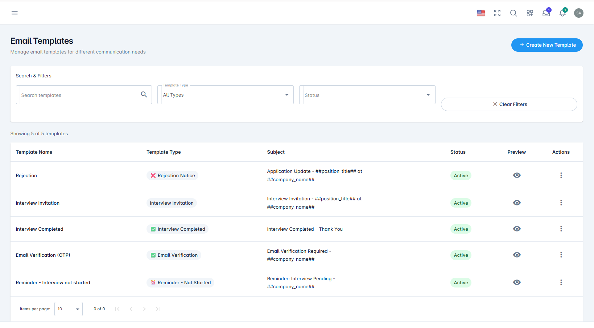
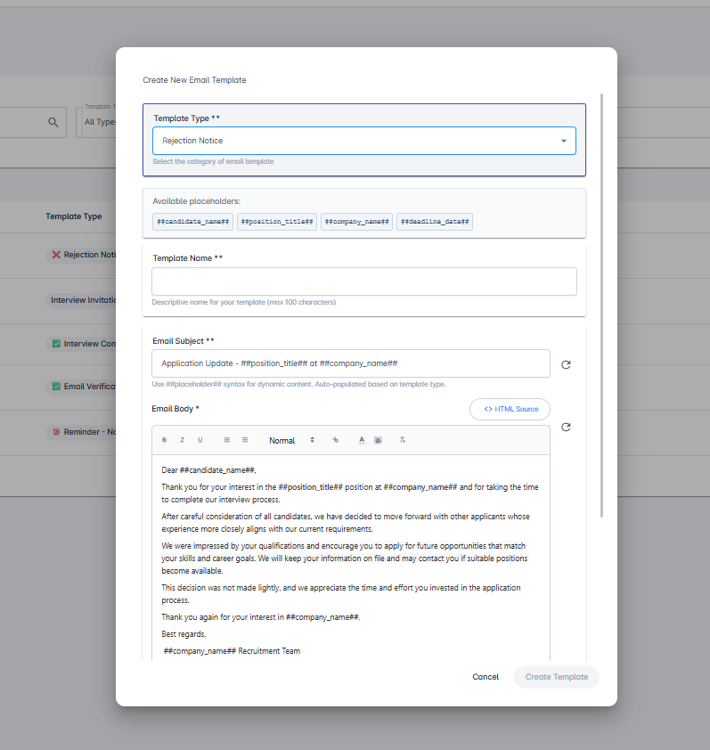
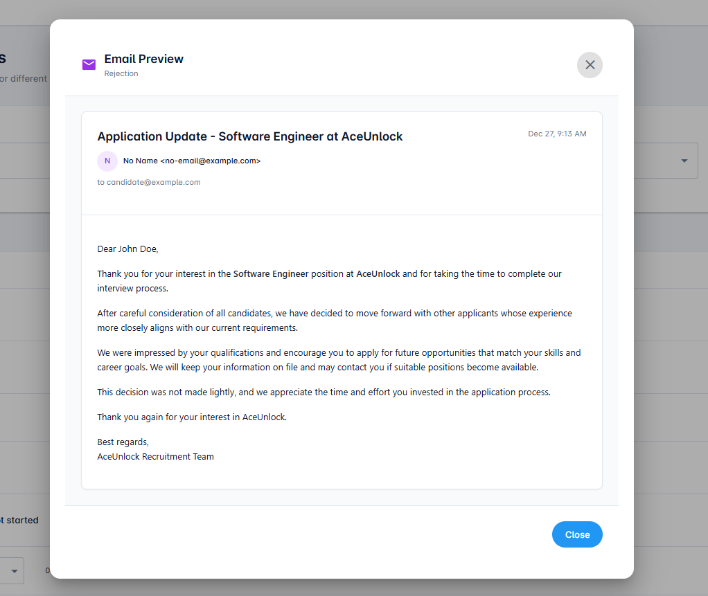
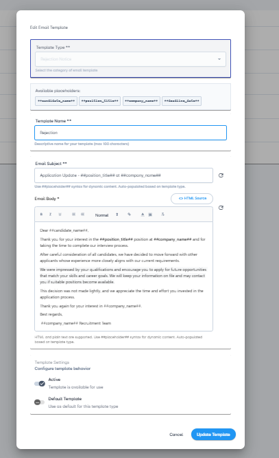
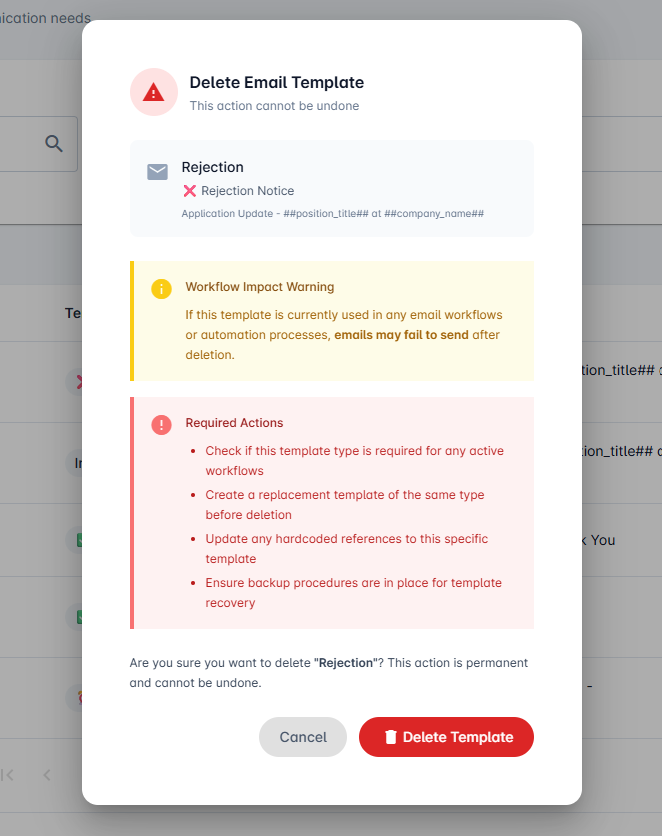

# Email Templates

Manage customizable email templates for various communications with candidates and applicants throughout the recruitment process.

## Overview

The Email Templates feature allows you to create, manage, and customize automated email notifications sent to candidates during different stages of the recruitment process. With support for multiple template types and personalization options, you can ensure consistent and professional communication with all applicants.

## Key Features

### Search & Filter

The dashboard includes powerful search and filter capabilities to help you quickly find the templates you need:

- **Text Search**: Type keywords to search for specific templates by name or content
- **Template Type Filter**: Filter templates by their purpose
- **Status Filter**: Filter templates by their active or inactive status

#### Available Template Types

The platform supports the following template types:

- **Interview Invitation** - Invite candidates to scheduled interviews
- **Email Verification OTP** - Send one-time passwords for email verification
- **Interview Completed** - Notify candidates after completing an interview
- **Reminder - Not Started** - Remind candidates who haven't started their assessment
- **Reminder - Incomplete** - Remind candidates with incomplete applications
- **Public Link Access** - Provide access to public application links
- **Advance to Next Round** - Notify candidates of advancement in the hiring process
- **Rejection Notice** - Send professional rejection notifications

### Create New Template

Create custom email templates tailored to your organization's communication needs.

**To create a new template:**

1. Click **"Create New Template"** to open the template creation dialog
2. Select the **Template Type** from the dropdown menu
3. Review the **Available Placeholders** section, which displays dynamic fields you can use to personalize your emails (placeholders vary by template type)
4. Enter a custom **Template Name** for easy identification
5. Customize the **Email Subject** and **Email Body** (both fields are pre-populated with default content based on the selected template type)
6. Set the template status using the **Active/Inactive** toggle (default: Active)
7. Optionally, set this as the **Default Template** using the second toggle (default: No)

**Note on Default Templates**: When a template is set to **Active** and **Default: Yes**, it will be automatically used for that communication type. For example, you can create multiple rejection email templates, but only the one marked as active and default will be sent to candidates.

### Preview Template

Visualize how your email will appear to candidates before sending.

**To preview a template:**

1. Locate the template in the main dashboard
2. Click the **eye icon** in the template row
3. A modal window will display the email preview with sample data merged into the placeholders

The preview feature helps you verify formatting, content, and placeholder functionality before activating the template.

### Edit Template

Modify existing templates to update content or settings.

**To edit a template:**

1. Click the **three vertical dots** (⋮) in the Actions column
2. Select **"Edit Template"** from the dropdown menu
3. A modal dialog will open with all editable fields
4. Make your desired changes to any field including:
   - Template name
   - Email subject
   - Email body
   - Active/Inactive status
   - Default template setting
5. Click **"Save"** or **"Update Template"** to apply your changes

All template fields can be modified, including name, subject, body, status, and default settings.

### Duplicate Template

Create a copy of an existing template to quickly build variations.

**To duplicate a template:**

1. Click the **three vertical dots** (⋮) in the Actions column
2. Select **"Duplicate"** from the dropdown menu
3. A copy will be created automatically with "_copy" appended to the template name

*Example*: If your original template is named "Rejection", the duplicate will be named "Rejection_copy"

This feature is useful when you want to create similar templates with minor variations for different scenarios or departments.

### Deactivate Template

Temporarily disable templates without deleting them.

**To deactivate a template:**

1. Click the **three vertical dots** (⋮) in the Actions column
2. Select **"Deactivate"** from the dropdown menu
3. The template status will change to **Inactive**

Inactive templates are preserved in the system but won't be used for automated communications. You can reactivate them at any time by editing the template and toggling the status to Active.

### Delete Template

Permanently remove templates that are no longer needed.

**To delete a template:**

1. Click the **three vertical dots** (⋮) in the Actions column
2. Select **"Delete"** from the dropdown menu
3. A confirmation dialog will appear asking you to confirm the deletion
4. Review the template details in the confirmation dialog
5. Click **"Delete Template"** to permanently remove the template, or **"Cancel"** to abort

**Warning**: Deletion is permanent and cannot be undone. Consider deactivating templates instead if you might need them in the future.

## Best Practices

- **Use Descriptive Names**: Give your templates clear, descriptive names to easily identify their purpose
- **Test with Preview**: Always preview templates before activating them to ensure placeholders are working correctly
- **Keep One Default Active**: For each template type, maintain only one active default template to avoid confusion
- **Regular Updates**: Review and update templates periodically to ensure messaging stays current and aligned with your brand
- **Duplicate Before Editing**: When making major changes to a working template, duplicate it first to preserve the original
- **Use Placeholders**: Leverage available placeholders to personalize emails and improve candidate experience

## Need Help?

Can't find what you're looking for?
- Search our [FAQ](../faq/README.md)
- Contact support at support@aceunlock.com
