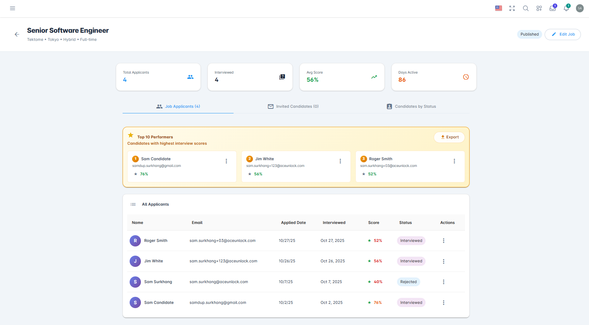
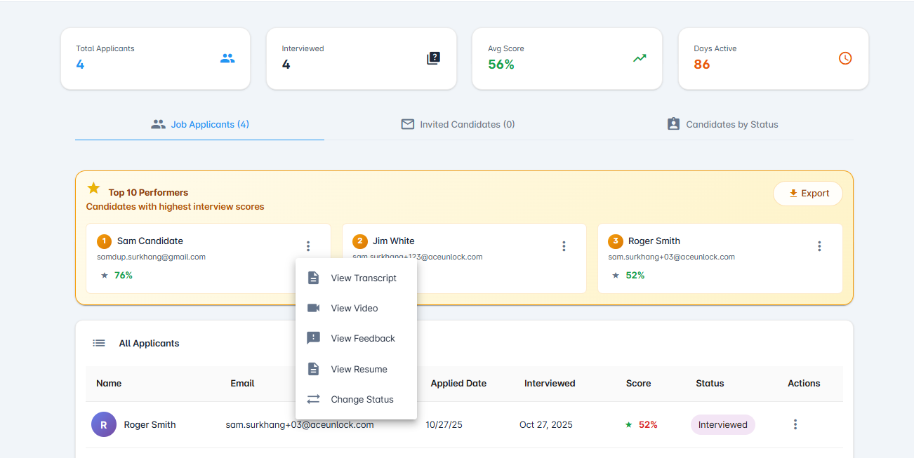
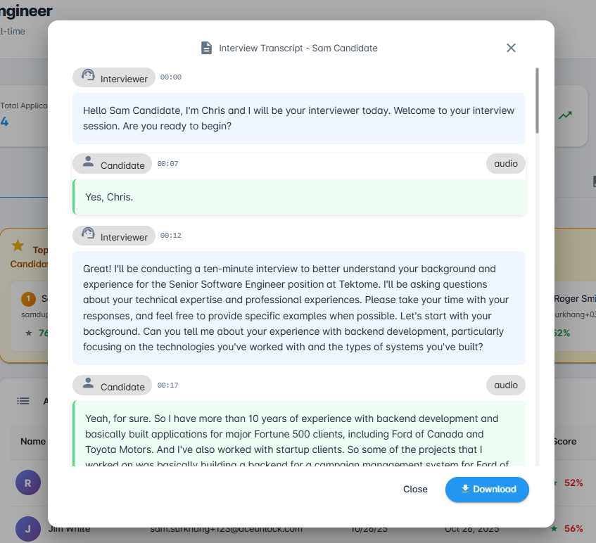
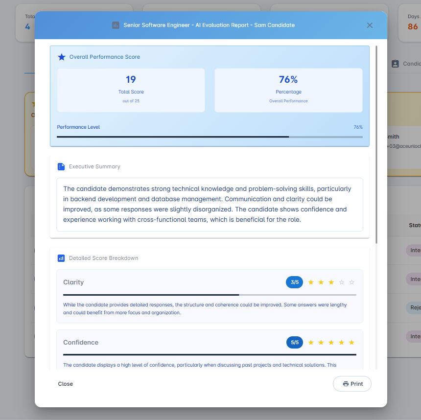
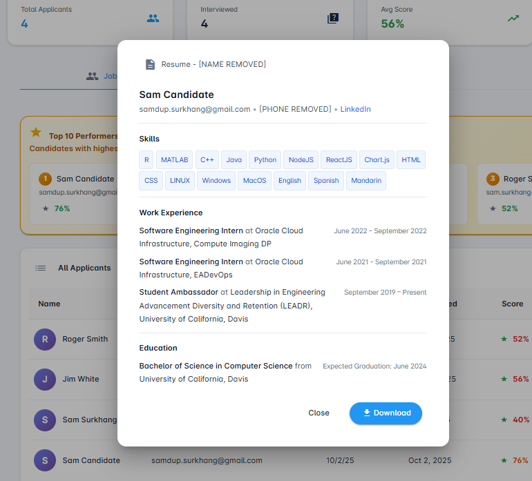
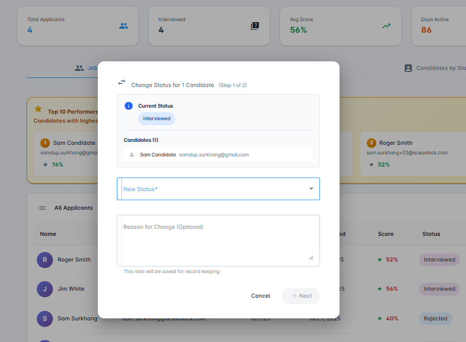
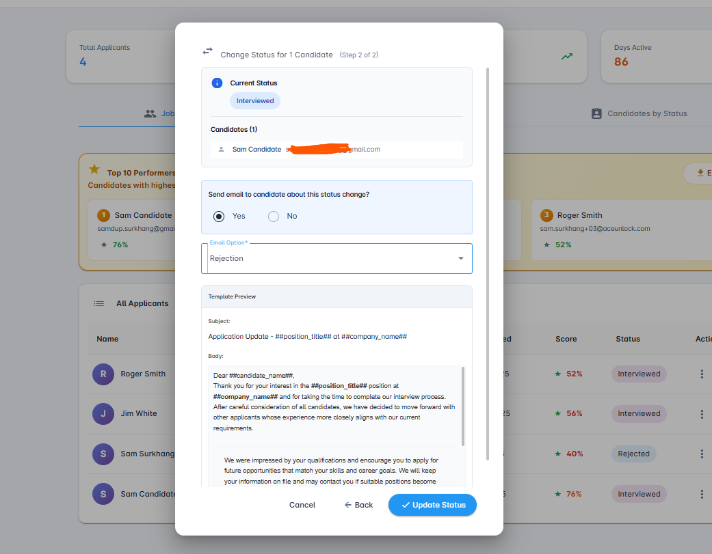
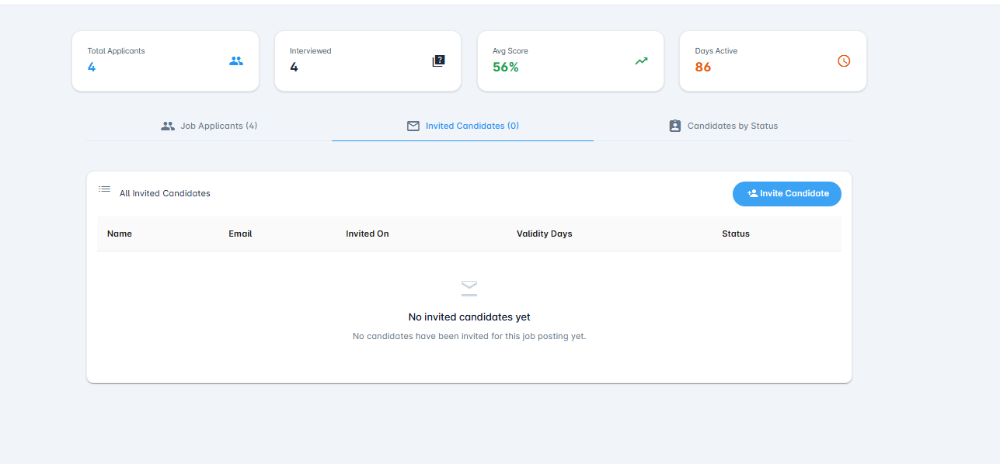
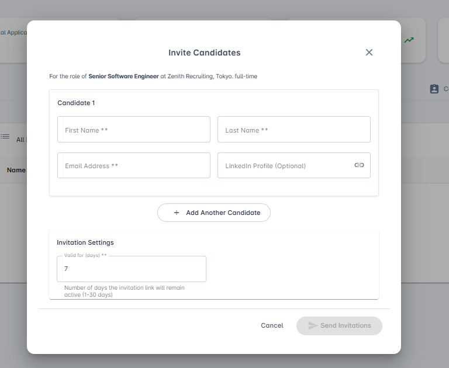
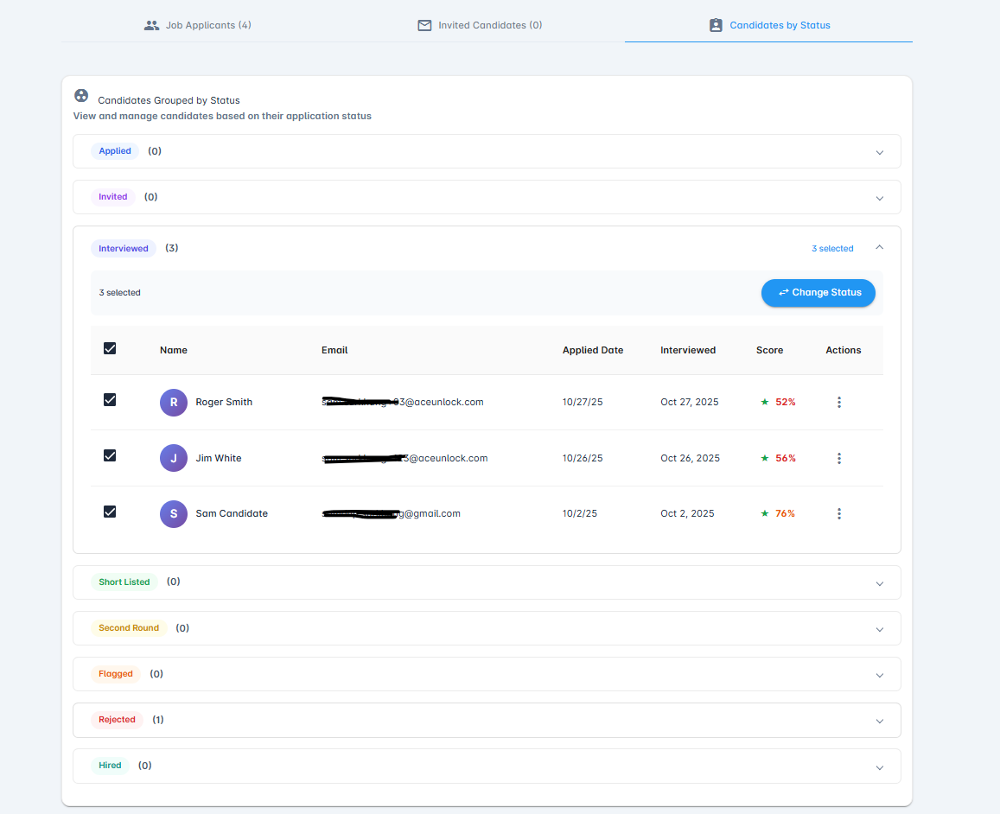

# Interview Dashboard

The Interview Dashboard provides a comprehensive 360-degree view of all applicants who have interviewed for a specific job posting, including real-time insights and a shortlist of top performers.

## Overview

The Interview Dashboard is the most important page for recruiters and administrators after a job posting goes live. It provides real-time visibility into:

- All interviews conducted by the AI interviewer
- All evaluations performed by the AI evaluator based on the evaluation rubric
- Top-performing candidates based on AI assessment
- Application status and candidate management

For high-volume job postings with 50+ completed interviews, this dashboard offers an efficient way to manage candidates, review shortlists, and track job posting activity.

### Accessing the Dashboard

1. Navigate to the **Job Postings** page
2. Locate the desired job posting in the table
3. Click on the **job posting name**
4. The Interview Dashboard will open for that specific job

## Dashboard Overview

### Key Metrics

At the top of the dashboard, four key metric cards provide a quick snapshot of your job posting performance:

- **Total Applicants**: Shows the total number of applicants for this job posting
- **Interviewed**: Displays the number of candidates who have completed their interview
- **Average Score**: Shows the average score of the candidate pool (out of 100)
- **Days Active**: Indicates how long this job posting has been active

### Dashboard Tabs

The dashboard is organized into three main tabs:

1. **Job Applicants** (Default): Shows detailed information about all candidates
2. **Invited Candidates**: Displays privately invited candidates with invitation management tools
3. **Candidates by Status**: Groups candidates by status with bulk action capabilities

## Job Applicants Tab

### Top Performers Section

The Top Performers section displays a curated shortlist of the highest-scoring candidates based on AI evaluation of interview transcripts. This prioritized list helps recruiters quickly identify the most qualified applicants.

The section features a highlighted yellow card showing "Top 10 Performers - Candidates with highest interview scores" along with an **Export** button to download the list.

#### Available Actions for Top Performers

Click the **three vertical dots** (⋮) next to any top performer to access the following actions:

##### View Transcript

Opens a modal dialog displaying the complete interview transcript between the candidate and the AI interviewer.

- Review the full conversation to assess communication skills and responses
- See timestamped exchanges between the interviewer and candidate
- Audio indicators show which responses were given verbally
- Download the transcript using the **Download** button for offline review or record-keeping
- Verify AI evaluation accuracy

##### View Video

Opens the recorded video of the interview between the candidate and the AI interviewer.

- Observe candidate demeanor and presentation
- Assess non-verbal communication skills
- Review technical demonstrations or screen sharing
- Video player includes standard playback controls (play/pause, timeline, volume, fullscreen)

##### View Feedback

Opens a modal dialog showing the comprehensive AI evaluation report.

**Includes:**
- **Overall Performance Score**: Displays both the total score (e.g., "19 out of 25") and percentage (e.g., "76%")
- **Performance Level**: Visual progress bar showing the candidate's performance level
- **Executive Summary**: High-level assessment overview with key strengths and areas for improvement
- **Detailed Score Breakdown**: Individual scores for each rubric criteria (e.g., Clarity: 3/5, Confidence: 5/5)
- **Evaluation Rationale**: AI reasoning and detailed feedback for each criteria
- **Print Option**: Print button to create a hard copy of the evaluation report

This feature helps recruiters understand exactly how candidates were evaluated against your hiring criteria.

##### View Resume

Available for job postings that require resume uploads.

- Opens a dialog displaying candidate information and **resume highlights** including:
  - Contact information (email, phone, LinkedIn profile)
  - Skills section with technology tags
  - Work experience with dates and descriptions
  - Education details
- Click **"Download"** to view the complete resume file
- Quickly assess candidate qualifications and experience

##### Change Status

Allows recruiters to manually override candidate status and maintain control over the hiring process.

**Change Status Workflow:**

**Step 1: Select New Status**
1. Click **"Change Status"** from the action menu
2. A dialog opens showing:
   - Current status (e.g., "Interviewed")
   - The candidate(s) being updated
   - **New Status** dropdown to select the desired status
   - **Reason for Change** text field (optional but recommended for audit purposes)
   - Note: "This note will be saved for record keeping"
3. Example: If you suspect a candidate has cheated, you can reject them with a documented reason

**Step 2: Email Notification**
1. Choose whether to send an email to the candidate (Yes/No radio buttons)
2. If **Yes**, select an appropriate **Email Option** from the dropdown (e.g., "Rejection")
3. Review the **Template Preview** showing:
   - Email subject line with placeholders
   - Email body content with formatted message
4. Click **"Update Status"** to apply changes and send notification

**Important**: Changing a candidate's status (e.g., to rejected) will remove them from the Top Performers section. This feature ensures recruiters can override AI evaluations and maintain final hiring decisions.

### All Applicants Section

The All Applicants section displays a comprehensive table of all candidates who applied for the position, sorted by most recent applications first.

#### Table Features

- **Complete Candidate List**: View all applicants regardless of status
- **Current Status Display**: See each candidate's current position in the hiring pipeline
- **Action Menu**: Same actions available as Top Performers (View Transcript, View Video, View Feedback, View Resume, Change Status)

#### Filter by Status

Use the **hamburger menu** (☰) in the top-left corner to filter candidates by status. This is particularly useful for:

- High-volume job postings with many applicants
- Focusing on specific stages of the hiring process
- Quick access to candidates in a particular status category

## Invited Candidates Tab

The Invited Candidates tab manages candidates who were privately invited to interview for the position, separate from public applicants.

### Invite New Candidates

**To invite candidates:**

1. Click the **"Invite Candidate"** button (blue button in the top-right)
2. A modal dialog opens titled "Invite Candidates" showing the role details
3. For each candidate, enter:
   - **First Name** (required)
   - **Last Name** (required)
   - **Email Address** (required)
   - **LinkedIn Profile** (optional)
4. Click **"Add Another Candidate"** to add more candidates to the invitation batch
5. In the **Invitation Settings** section, set the **Valid for (days)** (number of days the invitation remains active, e.g., 7 days)
   - Valid range: 1-30 days
6. Click **"Send Invitations"** to dispatch emails to all entered candidates

**Candidate Experience:**
- Invited candidates receive an email with a unique link to the job interview page
- Clicking the link takes them directly to the interview room
- Candidates can interview on-demand at their convenience

### Invited Candidates Table

View all previously invited candidates in a table format showing:
- **Name**: Candidate name
- **Email**: Email address where invitation was sent
- **Invited On**: Date the invitation was sent
- **Validity Days**: Number of days the invitation remains active
- **Status**: Current status of the invited candidate

When no candidates have been invited yet, the table displays: "No invited candidates yet - No candidates have been invited for this job posting yet."

## Candidates by Status Tab

The Candidates by Status tab provides a grouped view of all applicants organized by their current status, making bulk operations efficient and intuitive.

### Features

- **Status Groups**: All applicants are organized into collapsible status categories with counts:
  - Applied (0)
  - Invited (0)
  - Interviewed (3)
  - Short Listed (0)
  - Second Round (0)
  - Flagged (0)
  - Rejected (1)
  - Hired (0)
- **Count Display**: Each status shows the number of candidates in that category in parentheses
- **Expandable Sections**: Click to expand any status and view all candidates within that group
- **Selection Counter**: Shows "X selected" when candidates are checked
- **Bulk Action Button**: "Change Status" button appears when candidates are selected

### Bulk Status Changes

Efficiently manage multiple candidates simultaneously:

**To change status for multiple candidates:**

1. **Expand** the desired status group (e.g., "Interviewed (3)")
2. **Select** one or multiple candidates using the checkboxes in the left column
3. The selection count appears at the top (e.g., "3 selected")
4. Click the **"Change Status"** button (blue button in the top-right)
5. Follow the same two-step process as individual status changes:
   - **Step 1**: Choose the new status and provide a reason (optional)
   - **Step 2**: Choose whether to send email notifications and select a template
6. Click **"Update Status"** to apply changes to all selected candidates

**Use Case Example**: If you want to reject all candidates below a certain score threshold, you can:
1. Expand the "Interviewed" status group
2. Review the scores column
3. Select all candidates below your threshold (e.g., below 50%)
4. Change their status to "Rejected" in bulk
5. Send rejection emails simultaneously using a template

This is particularly convenient for high-volume job postings.

## Best Practices

- **Review Top Performers First**: Start with the shortlisted candidates to identify the best fits quickly
- **Check Video and Transcript**: Don't rely solely on AI scores; review transcripts and videos for deeper insights
- **Document Status Changes**: Always provide clear reasons when changing candidate status for compliance and team alignment
- **Use Bulk Actions**: For high-volume postings, leverage the Candidates by Status tab for efficient processing
- **Regular Monitoring**: Check the dashboard regularly when your job posting is active to stay on top of new applications
- **Verify AI Evaluations**: Use the View Feedback feature to understand how candidates were scored and ensure alignment with your criteria
- **Invite Strategically**: Use the Invited Candidates feature to proactively recruit specific talent
- **Set Appropriate Invitation Expiry**: Choose invitation validity periods that give candidates enough time to respond while maintaining hiring momentum

## Need Help?

Can't find what you're looking for?
- Search our [FAQ](../faq/README.md)
- Contact support at support@aceunlock.com
