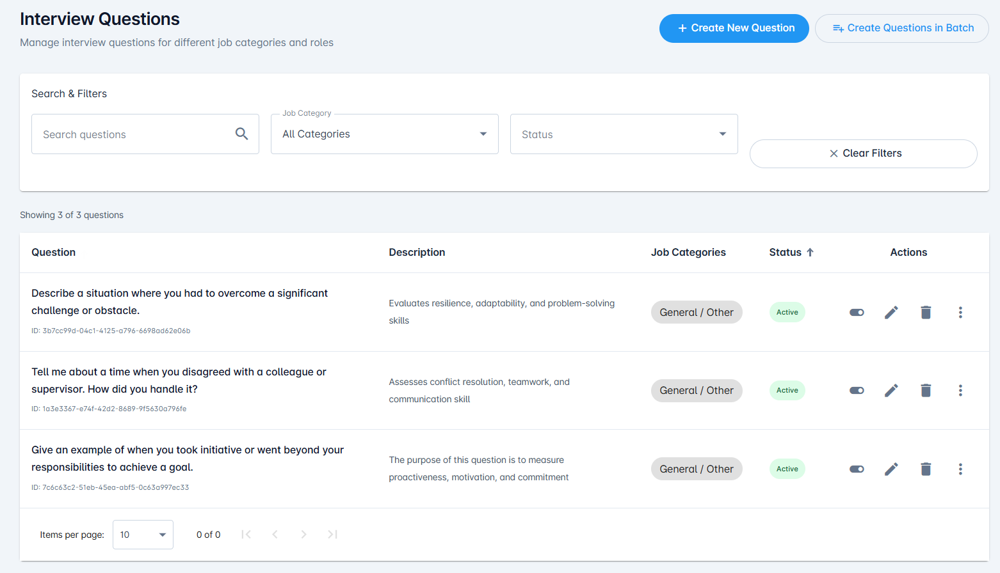
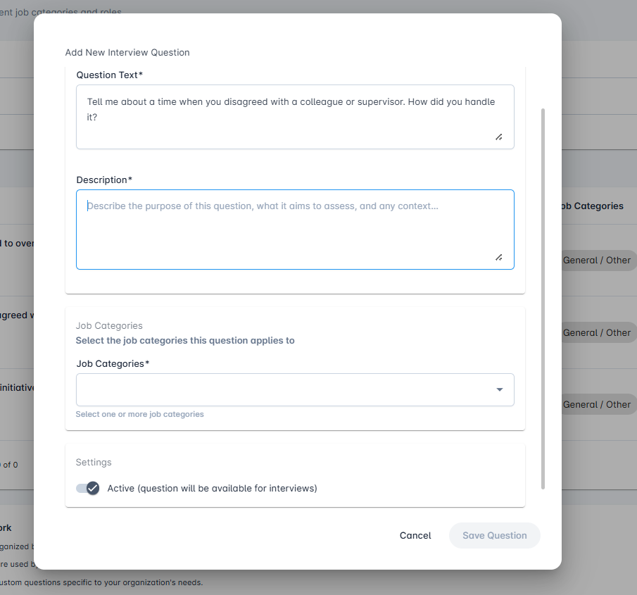
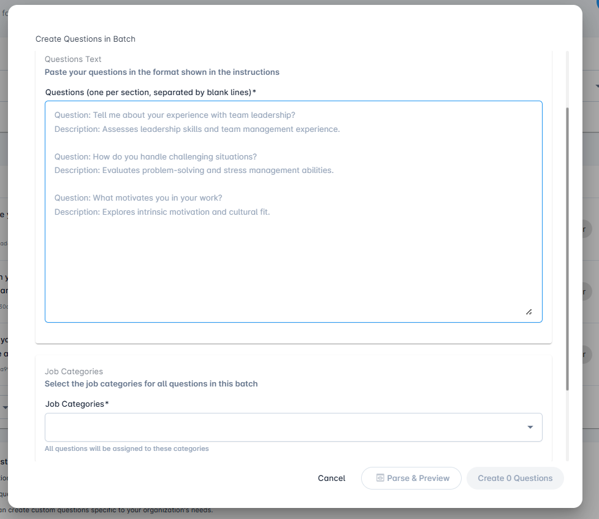
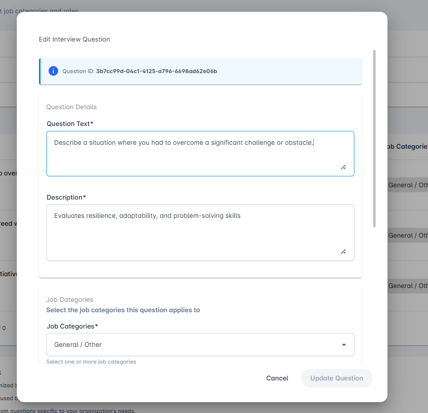

# Interview Questions

Centralized dashboard for managing interview questions across different job categories and roles.

## Overview

The Interview Questions feature provides recruiters and administrators with a comprehensive question bank management system. This dashboard allows you to create, organize, and manage interview questions that can be used across all your job postings.

**Key Benefits:**

- **Centralized Management**: All your interview questions in one place
- **Pre-loaded Content**: New companies start with a library of behavioral interview questions
- **Category Organization**: Questions organized by job category for easy discovery
- **Reusable Questions**: Create once, use across multiple job postings
- **Quality Control**: Ensure consistency in interview quality across all positions
- **Flexible Creation**: Add questions individually or in bulk

When your company first starts using AceUnlock, your question bank is pre-populated with proven behavioral interview questions, giving you a head start in creating structured interviews.



## Dashboard Features

### Feature 1: Search and Filter

When managing a large question bank, powerful search and filtering capabilities help you quickly find the right questions.

The dashboard displays "Showing 3 of 3 questions" (or the current count) to help you track your results.

**Search by Text:**
- Use the search textbox labeled **"Search questions"** to find questions by keyword
- Search looks through question text and descriptions
- Results update in real-time as you type
- Useful for finding specific topics or competencies

**Filter by Job Category:**

Use the **Job Category** dropdown to filter questions by role type. Available categories include:

- **All Categories** - Show all questions
- **Customer Service** - Questions for customer-facing roles
- **Design & Creative** - Questions for designers, creatives, and content creators
- **Engineering/Technical** - Questions for software engineers, developers, and technical roles
- **Finance & Accounting** - Questions for finance professionals and accountants
- **Healthcare & Personal Care** - Questions for healthcare and wellness professionals
- **Hospitality, Food & Customer Service** - Questions for hospitality and food service roles
- **Human Resources** - Questions for HR professionals and people operations
- **Operations & Logistics** - Questions for operations, supply chain, and logistics roles
- **Product Management** - Questions for product managers and product owners
- **Sales, Marketing & Business Development** - Questions for revenue-generating roles
- **General/Other** - Universal questions applicable to any role

**Filter by Status:**

Control which questions appear in your results:
- **Active** - Questions available for use in job postings
- **Inactive** - Questions that are archived or under review

**Clear Filters:**

Click **"Clear Filters"** (with X icon) to reset all search and filter criteria and view your complete question bank.

**Question Table Display:**

The dashboard displays questions in a table format with the following columns:

- **Question**: The full question text with a unique Question ID displayed below
- **Description**: Brief explanation of what the question assesses
- **Job Categories**: Category tag (e.g., "General / Other")
- **Status**: Active status badge (green for Active)
- **Actions**: Four action icons:
  - Toggle switch (enable/disable question)
  - Edit icon (pencil) - Edit the question
  - Delete icon (trash) - Remove the question
  - More actions menu (three dots) - Additional options

**Pagination:**

At the bottom of the table:
- **Items per page**: Dropdown to select how many questions to display (default: 10)
- **Page counter**: Shows current page range (e.g., "0 of 0")
- **Navigation arrows**: Move between pages when you have multiple pages of questions

### Feature 2: Create New Question

Add individual questions to your question bank with full control over all details.

**How to Create:**

1. Click the **+ Create New Question** button (blue button in top-right of dashboard)
2. A modal dialog titled **"Add New Interview Question"** opens with the question creation form

**Question Form Fields:**

**Question Text*** (Required):
- Text area for entering the interview question
- Enter the question exactly as it should be asked
- Be clear and specific
- Avoid ambiguous language
- Example shown in image: "Tell me about a time when you disagreed with a colleague or supervisor. How did you handle it?"

**Description*** (Required):
- Text area for explaining the question's purpose
- Placeholder text: "Describe the purpose of this question, what it aims to assess, and any context..."
- Explain the purpose of the question
- Describe what competencies or traits it assesses
- Provide context for the AI interviewer to ask the question effectively
- Include guidance on what makes a strong answer
- Example: "Assesses conflict resolution, teamwork, and communication skill"

**Job Categories**:
- Section header: "Select the job categories this question applies to"
- **Job Categories*** (Required): Dropdown field
- Placeholder: "Select one or more job categories"
- Choose the most relevant category for this question
- Helps with organization and filtering
- Questions can be used across categories even if assigned to one

**Settings**:
- ☑ **Active (question will be available for interviews)**: Checkbox
- When checked: Question is available for use in job postings
- When unchecked: Question is saved but not available for selection (Inactive)

**Action Buttons:**
- **Cancel**: Close dialog without saving
- **Save Question**: Add the question to your question bank (button is disabled until all required fields are completed)



**After Saving:**

Once you click **"Save Question"**, the question immediately appears in the dashboard and becomes available for use in job postings (if set to Active).

### Feature 3: Create Questions in Batch

Quickly create multiple questions at once for efficient question bank building.

**How to Use Batch Creation:**

1. Click the **Create Questions in Batch** button (located next to Create New Question button in top-right)
2. A modal dialog titled **"Create Questions in Batch"** opens with a text area for bulk entry

**Dialog Sections:**

**Questions Text**
*Paste your questions in the format shown in the instructions*

**Questions (one per section, separated by blank lines)*** (Required):
- Large text area for entering multiple questions
- The field shows placeholder examples:
  ```
  Question: Tell me about your experience with team leadership?
  Description: Assesses leadership skills and team management experience.

  Question: How do you handle challenging situations?
  Description: Evaluates problem-solving and stress management abilities.

  Question: What motivates you in your work?
  Description: Explores intrinsic motivation and cultural fit.
  ```

**Format for Batch Entry:**

Follow this specific format for successful parsing:

```
Question: Tell me about your experience with team leadership?
Description: Assesses leadership skills and team management experience.

Question: How do you handle challenging situations?
Description: Evaluates problem-solving and stress management abilities.

Question: What motivates you in your work?
Description: Explores intrinsic motivation and cultural fit.
```

**Important Formatting Rules:**
- Start each question with **"Question:"** prefix followed by the question text
- Start each description with **"Description:"** prefix followed by the description text
- **Empty line**: Required to separate one question from the next
- Descriptions can include multiple sentences on the same line or continue on additional lines
- Keep formatting consistent throughout

**Job Categories Section**
*Select the job categories for all questions in this batch*

**Job Categories*** (Required):
- Dropdown field for category selection
- Note below: "All questions will be assigned to these categories"
- Select a category that will be applied to ALL questions in the batch
- Ensures consistency and proper organization

**Action Buttons:**

At the bottom of the dialog:
- **Cancel**: Close without creating questions
- **Parse & Preview**: Analyze your formatted text and show preview
- **Create 0 Questions**: Button shows count (e.g., "Create 3 Questions" after parsing)



**Parse & Preview:**

1. After entering your questions in the correct format, click the **"Parse & Preview"** button
2. The system analyzes your formatted text
3. If successful, the button text updates to show the count (e.g., **"Create 3 Questions"**)
4. A preview section may appear showing:
   - Number of questions that will be created
   - Preview of each parsed question
   - Confirmation of the category assignment

**Create Questions:**

Once you've reviewed the parsed results:
1. The button now shows **"Create [N] Questions"** where N is the number of questions detected
2. Click this button to create all questions at once
3. All questions are automatically created and added to your question bank
4. Questions are set to Active status by default
5. The dialog closes and your dashboard refreshes with the new questions

**Benefits of Batch Creation:**
- Save significant time when building your question bank
- Maintain consistency with category assignment across multiple questions
- Import questions from existing documents or spreadsheets
- Ideal for onboarding or migrating from another system
- Perfect for creating complete question sets for specific job categories

### Feature 4: Edit Question

Modify existing questions to improve clarity, update descriptions, or change categorization.

**How to Edit:**

1. Locate the question in the dashboard table
2. Click the **Edit icon** (pencil icon) in the Actions column of the question row
3. A modal dialog titled **"Edit Interview Question"** opens with the question details pre-filled

**Information Banner:**

At the top of the dialog, you'll see a blue information banner displaying:
ℹ️ **Question ID: [unique-id]**
- Example: "3b7cc99d-04c1-4125-a796-6698ad62e06b"
- This is the permanent identifier for the question

**Editable Fields:**

**Question Details**

**Question Text*** (Required):
- Text area showing the current question
- Example shown: "Describe a situation where you had to overcome a significant challenge or obstacle."
- Modify the wording or structure of the question
- Changes appear in real-time

**Description*** (Required):
- Text area showing the current description
- Example shown: "Evaluates resilience, adaptability, and problem-solving skills"
- Update the purpose, assessment criteria, or context
- Provide additional guidance if needed

**Job Categories**
*Select the job categories this question applies to*

**Job Categories*** (Required):
- Dropdown showing current selection
- Example shown: "General / Other"
- Note below: "Select one or more job categories"
- Change the job category assignment
- Can select different categories

**Action Buttons:**

- **Cancel**: Close dialog without saving changes
- **Update Question**: Save your modifications (only enabled when changes are made)



**Save Changes:**

Click **"Update Question"** to save your modifications. The question is immediately updated in the question bank and any changes will apply to future job postings that use this question.

**Best Practice:** If a question is already in use in active job postings, consider the impact of changes. For significant modifications, you may want to create a new version instead of editing to avoid disrupting ongoing interviews.

### Feature 5: Delete Question

Remove questions that were created accidentally or are no longer needed.

**How to Delete:**

1. Locate the question in the dashboard table
2. Click the **Delete icon** (trash icon) in the Actions column of the question row
3. A confirmation dialog appears with the message: **"Are you sure you want to delete this question?"**

**Confirmation:**
- Click **"Yes"** (or confirm button) to permanently delete the question
- Click **"Cancel"** to keep the question and close the dialog

**Important Considerations:**

- **Deletion is permanent** and cannot be undone
- Deleted questions are removed from the question bank immediately
- If the question is attached to active job postings, it may impact those postings
- Consider setting the question to **Inactive** instead of deleting if:
  - The question is referenced in historical data
  - You might need it again in the future
  - It's currently used in active job postings

**Alternative to Deletion:** 

Instead of deleting, you can use the **toggle switch** in the Actions column to set the question to Inactive status. This:
- Preserves the question for historical reference
- Removes it from active use in new job postings
- Allows you to reactivate it later if needed
- Maintains data integrity for past interviews

## Getting Started

### Step 1: Explore Pre-loaded Questions

When you first access the Interview Questions dashboard:

1. Navigate to **Interview Questions** from the left sidebar
2. Review the pre-loaded behavioral questions in your question bank
3. Familiarize yourself with the existing categories and question structure
4. Use search and filters to explore questions by category

### Step 2: Organize Your Question Bank

Before creating new questions:

1. Review existing questions to avoid duplicates
2. Identify gaps in your question coverage
3. Decide which job categories are most important for your organization
4. Plan your question creation strategy (individual vs. batch)

### Step 3: Create Your First Question

To add a custom question:

1. Click **Create New Question**
2. Enter a clear, specific question text
3. Write a detailed description explaining what to assess
4. Select the appropriate job category
5. Set status to Active
6. Click **Save Question**

### Step 4: Use Batch Creation (Optional)

If you have multiple questions to add:

1. Prepare your questions in the required format
2. Click **Create Questions in Batch**
3. Paste your formatted questions
4. Select the job category
5. Click **Parse & Preview** to verify
6. Click **Create Questions** to add them all at once

### Step 5: Attach Questions to Job Postings

Once your question bank is ready:

1. Create or edit a job posting
2. Navigate to the **Interview Setup** section
3. Click **Select from Categories** or **Add Custom Question**
4. Choose questions from your question bank
5. Save your job posting

## Best Practices

### Creating Effective Questions

1. **Be Specific and Clear**
   - Ask questions that have a clear focus
   - Avoid multiple questions in one
   - Use simple, direct language

2. **Write Comprehensive Descriptions**
   - Explain what competencies the question assesses
   - Provide context for the AI interviewer
   - Include what constitutes a strong answer
   - Note any red flags to watch for

3. **Use Behavioral Format**
   - Frame questions to elicit specific examples
   - Ask about past experiences, not hypotheticals
   - Use STAR method (Situation, Task, Action, Result) prompts
   - Example: "Tell me about a time when..." or "Describe a situation where..."

4. **Avoid Discriminatory Questions**
   - Focus solely on job-related competencies
   - Never ask about age, religion, marital status, family plans, etc.
   - Stay compliant with employment laws
   - When in doubt, consult with HR or legal counsel

### Organizing Your Question Bank

1. **Categorize Thoughtfully**
   - Assign questions to the most relevant category
   - Keep categorization consistent
   - Consider cross-functional questions (use General/Other)

2. **Maintain Quality Over Quantity**
   - Aim for 5-10 excellent questions per category
   - Regularly review and refine questions
   - Remove or inactivate questions that don't provide value

3. **Use Status Effectively**
   - Set to Active only questions that are ready for use
   - Use Inactive status for questions under development
   - Test new questions before making them active

4. **Regular Maintenance**
   - Review your question bank quarterly
   - Update descriptions based on interview feedback
   - Archive outdated or ineffective questions
   - Add new questions as roles evolve

### Batch Creation Tips

1. **Prepare in a Text Editor First**
   - Format your questions properly before pasting
   - Use a plain text editor to avoid formatting issues
   - Double-check the empty line separators

2. **Start Small**
   - Begin with 3-5 questions per batch
   - Verify the format works correctly
   - Scale up once comfortable with the process

3. **Use Consistent Descriptions**
   - Maintain similar description structure across questions
   - Include all necessary context in each description
   - Be thorough - descriptions guide the AI interviewer

### Integration with Job Postings

1. **Strategic Question Selection**
   - Attach 3-5 custom questions per job posting
   - Balance custom questions with AI-generated ones
   - Choose questions that address must-have competencies

2. **Category Alignment**
   - Select questions from categories matching the role
   - Use General/Other for universal competencies
   - Consider role level when choosing questions

3. **Consistency Across Similar Roles**
   - Use the same core questions for similar positions
   - Enables better candidate comparison
   - Maintains standardization in your hiring process

## Tips for Success

1. **Leverage Pre-loaded Questions**: Start with the provided behavioral questions and customize as needed

2. **Collaborate with Hiring Managers**: Involve department leaders in question creation for role-specific expertise

3. **Test Questions**: Review interview transcripts to see how candidates respond and refine accordingly

4. **Create Question Sets**: Develop standard question sets for common role types in your organization

5. **Document Best Practices**: Add detailed descriptions so all recruiters understand the intent behind each question

6. **Regular Updates**: Keep your question bank fresh by adding new questions based on evolving role requirements

7. **Use Filters Efficiently**: Save time by filtering to specific categories when creating job postings

8. **Track Usage**: Note which questions provide the most valuable insights and use them more frequently

## Related Features

- [Job Postings](./job-postings.md) - Create job postings and attach questions
- [Create New Job](./create-new-job.md) - Learn how to add questions when creating job postings
- [Quick Create](./quick-create.md) - Quick job posting creation
- [Rubrics](./rubrics.md) - Evaluation criteria for assessing interview responses

## Need Help?

Can't find what you're looking for?
- Search our [FAQ](../faq/README.md)
- Contact support at support@aceunlock.com
- Need help writing effective interview questions? Reach out to our team for guidance

