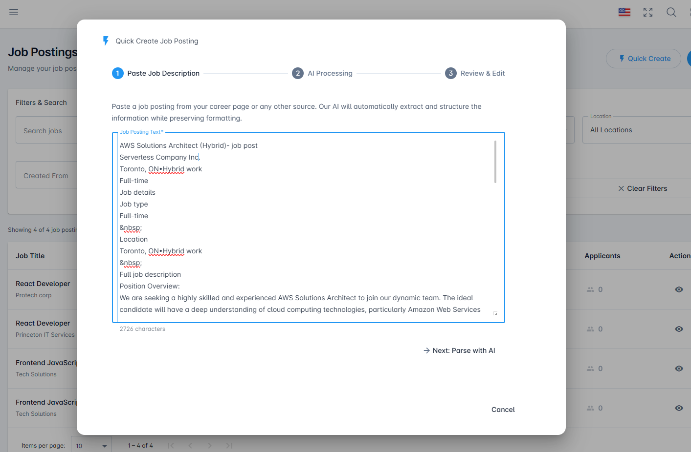
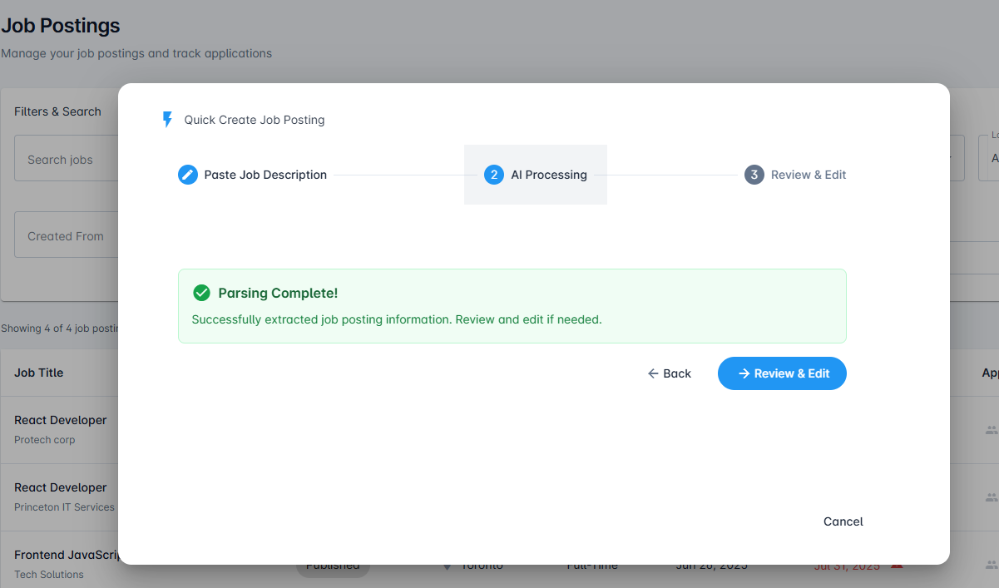
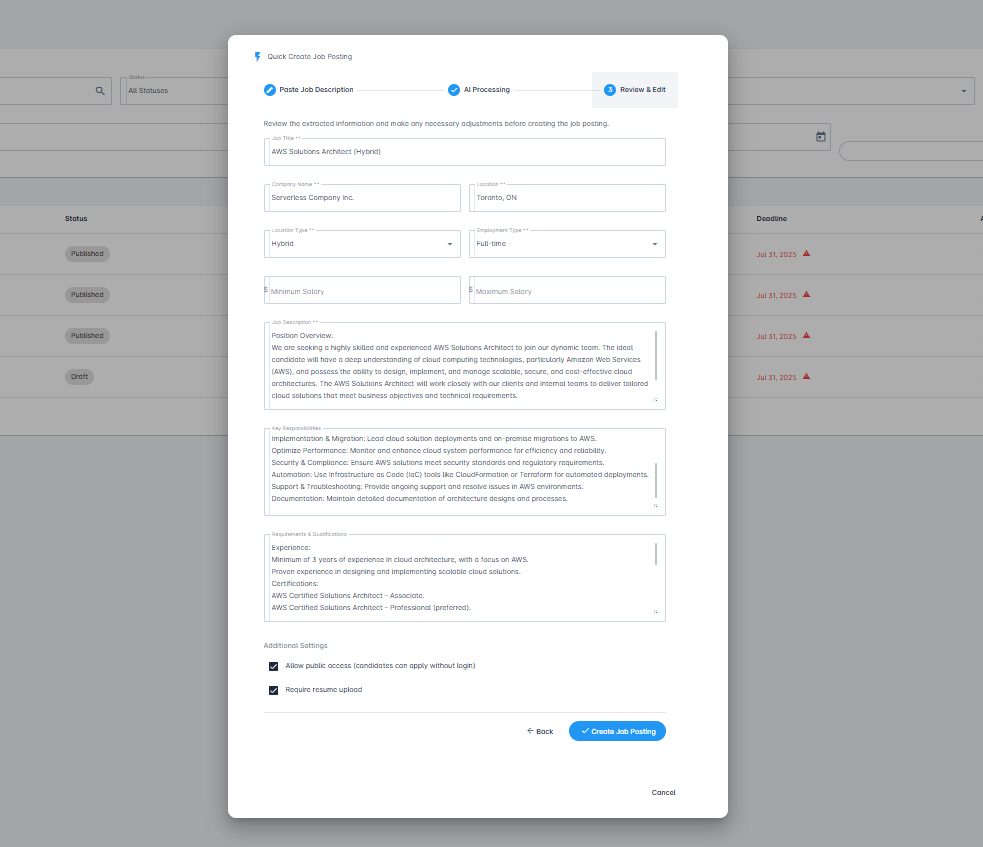

# Quick Create Job Posting

Rapidly create job postings with AI-powered automation in just 3 simple steps.

## Overview

Quick Create is an AI-powered feature that streamlines the job posting creation process. This feature is especially useful when you already have a job posting created in another ATS (Applicant Tracking System) or on a job board. Simply copy and paste from the source, and our intelligent system will automatically extract and populate all the necessary fields, saving you valuable time while maintaining accuracy.

This feature is perfect for:
- Migrating job postings from other ATS systems or job boards
- Reposting jobs from external platforms (Indeed, LinkedIn, etc.)
- Creating job postings quickly when time is limited
- Maintaining consistency across similar positions
- Reducing manual data entry errors
- Getting job postings live faster

## Prerequisites

Before using Quick Create, ensure you have:
- An active AceUnlock account (recruiter or administrator role)
- A prepared job description (can be from your existing job postings or created fresh)
- Appropriate permissions to create job postings in your organization

## Step-by-Step Guide

### Step 1: Paste Job Description

When you click the **Quick Create** button on the Job Postings dashboard, a modal dialog opens with the first step.

The dialog displays a 3-step progress indicator at the top:
1. **Paste Job Description** (active)
2. AI Processing
3. Review & Edit

**What to do:**
1. Paste your complete job description into the **Job Posting Text** field
2. The text area accepts formatted text and preserves your original structure
3. A character counter displays at the bottom (helpful for tracking length)
4. Ensure the description includes:
   - Job title and company name
   - Location and employment type (Full-time, Part-time, Hybrid, Remote, etc.)
   - Key responsibilities and duties
   - Required qualifications, skills, and experience
   - Any additional relevant details (certifications, benefits, etc.)
5. Click **Next: Parse with AI** to proceed

**Tips for best results:**
- Copy the complete job posting from your source (ATS, job board, career site)
- Paste all sections including headers like "Job details," "Job type," "Location," "Position Overview"
- Include structured sections (the AI recognizes headings like "&nbsp;", "Key Responsibilities," "Requirements")
- Don't worry about formatting - the AI will extract and structure the information
- The more comprehensive your description, the better the AI extraction

### Step 2: AI Processing & Review

Once you click **Next: Parse with AI**, the system processes your job description. The progress indicator now shows **AI Processing** as the active step.

**What happens:**
- The AI parses your job description in real-time (usually takes just a few seconds)
- Key details are identified and categorized
- The system validates the extracted information

**Possible outcomes:**

**Success - Parsing Complete!**

If the AI successfully parses the job description, you'll see a green success message:

✓ **"Parsing Complete! Successfully extracted job posting information. Review and edit if needed."**

This means the AI has successfully identified and extracted:
- Job title
- Company name
- Location and location type (Remote, Hybrid, On-site)
- Employment type (Full-time, Part-time, Contract, Internship)
- Job description and overview
- Key responsibilities
- Requirements and qualifications

**Need Review:** If the AI encounters any ambiguities or missing critical information:
- You'll be notified which fields need attention
- Option to go **Back** and refine your job description
- Guidance on what additional information is needed

**What to do:**
- Review the success or error message
- Click **Review & Edit** to proceed to the final step and see all extracted fields, or
- Click **Back** to modify your job description if needed
- You can also click **Cancel** to exit the Quick Create process

### Step 3: Review and Create

In this final step, you'll see the complete job posting form pre-filled with all the AI-extracted information. The progress indicator shows **Review & Edit** as the active step.

The instructional text reads: *"Review the extracted information and make any necessary adjustments before creating the job posting."*

**What you'll see - Pre-filled Fields:**

**Basic Information:**
- **Job Title**: Extracted job title with any work arrangement details (e.g., "AWS Solutions Architect (Hybrid)")
- **Company Name**: Your organization or extracted company name (e.g., "Serverless Company Inc.")
- **Location**: City and region (e.g., "Toronto, ON")
- **Location Type**: Dropdown with options - Hybrid, Remote, On-site, etc.
- **Employment Type**: Dropdown showing Full-time, Part-time, Contract, or Internship

**Compensation (Optional):**
- **Minimum Salary**: Field for minimum salary range
- **Maximum Salary**: Field for maximum salary range

**Job Content:**
- **Job Description**: Rich text area with the full position overview extracted from your pasted content
- **Key Responsibilities**: Formatted list of duties and responsibilities with bullet points
- **Requirements & Qualifications**: Detailed list of required experience, certifications, and skills

**Additional Settings:**
The form includes checkboxes for application settings:
- ☑ **Allow public access (candidates can apply without login)** - Checked by default
- ☑ **Require resume upload** - Checked by default

**What to do:**
1. **Review all fields** carefully for accuracy
2. **Edit any fields** that need adjustment or refinement - all fields are editable
3. **Verify location type** (Hybrid, Remote, On-site) is correct
4. **Add salary range** if you want to display compensation (optional)
5. **Review the rich text areas** for formatting and completeness
6. **Adjust Additional Settings** checkboxes as needed
7. Click **Create Job Posting** to finalize, or click **Back** to return to the AI Processing step

**What happens next:**
- The dialog closes
- Your new job posting appears in the Job Postings dashboard
- The posting is created in **Draft** mode by default
- You can publish it when ready, or make further edits directly from the dashboard
- You can then attach interview questions, rubrics, and email templates from the job posting editor

## Best Practices

### Optimize Your Job Descriptions

For the best AI extraction results:

1. **Use Clear Headings**: Structure your description with sections like "Responsibilities," "Requirements," "Qualifications"
2. **Be Specific**: Include exact job titles, locations, and employment types
3. **List Skills Clearly**: Use bullet points for requirements and qualifications
4. **Include All Details**: Don't assume the AI will infer missing information

### Review Before Publishing

Even though the AI is highly accurate:

- Always review the extracted information in Step 3 before clicking **Create Job Posting**
- Verify that the job title, company name, location, and employment type are correct
- Check the location type (Remote, Hybrid, On-site) matches your requirements
- Review the Job Description, Key Responsibilities, and Requirements sections for completeness
- Add salary range if you want to display compensation information
- Verify the Additional Settings checkboxes align with your application process
- Remember: the posting is created in Draft mode, so you can make further edits after creation

### When to Use Quick Create vs. Create New Job

**Use Quick Create when:**
- You have an existing job description ready
- You need to create a posting quickly
- The job follows standard interview processes
- You're comfortable with default interview settings

**Use Create New Job when:**
- You need granular control over every setting
- The position requires custom interview configurations
- You want to attach specific questions and rubrics from the start
- You need to set up advanced application workflows

## Troubleshooting

### AI Parsing Issues

**Problem**: AI couldn't extract the job title
- **Solution**: Ensure the job title is clearly stated at the beginning of your description or in a "Title:" field
- **Solution**: Use the **Back** button in Step 2 to revise your job description

**Problem**: Location wasn't identified correctly
- **Solution**: Use standard location formats (e.g., "Remote," "New York, NY," "Toronto, ON, Canada")
- **Solution**: Include location information in a clear "Location:" section
- **Solution**: You can manually correct the location in Step 3 before creating the posting

**Problem**: Employment type is missing or incorrect
- **Solution**: Explicitly mention "Full-Time," "Part-Time," "Contract," or "Internship" in your description
- **Solution**: Include "Job type" or "Employment Type" as a section heading
- **Solution**: You can select the correct type from the dropdown in Step 3

### Dialog Not Opening

**Problem**: Quick Create button doesn't respond
- **Solution**: Check your internet connection and refresh the page
- **Solution**: Verify you have appropriate permissions to create job postings
- **Solution**: Clear your browser cache and try again

### Missing Fields After Creation

**Problem**: Some information wasn't transferred to the job posting
- **Solution**: This information can be added manually by editing the job posting
- **Solution**: For future postings, include the missing details explicitly in your job description

## Tips for Efficiency

1. **Save Templates**: Keep successful job descriptions as templates for similar positions
2. **Batch Creation**: Prepare multiple job descriptions in advance and use Quick Create to process them rapidly
3. **Consistency**: Use Quick Create for similar roles to maintain consistency across your organization
4. **Iterate**: If the first attempt needs refinement, use the **Back** button in Step 2 or Step 3 rather than starting over
5. **Monitor Length**: Use the character counter displayed at the bottom of the text area in Step 1 to ensure you've included sufficient detail
6. **Include Structure**: Copy job postings that have clear section headers - this helps the AI extract information more accurately
7. **Edit in Step 3**: Remember you can edit any field in Step 3, so don't worry if the AI extraction isn't perfect

## Related Features

- [Job Postings Dashboard](./job-postings.md) - Manage all your job postings
- [Create New Job](./create-new-job.md) - Comprehensive job posting creation
- [Interview Questions](./question.md) - Add custom questions to your postings
- [Evaluation Rubrics](./rubrics.md) - Attach custom evaluation criteria

## Need Help?

Can't find what you're looking for?
- Search our [FAQ](../faq/README.md)
- Contact support at support@aceunlock.com
- Watch our [Quick Create Tutorial Video](#) (coming soon)

