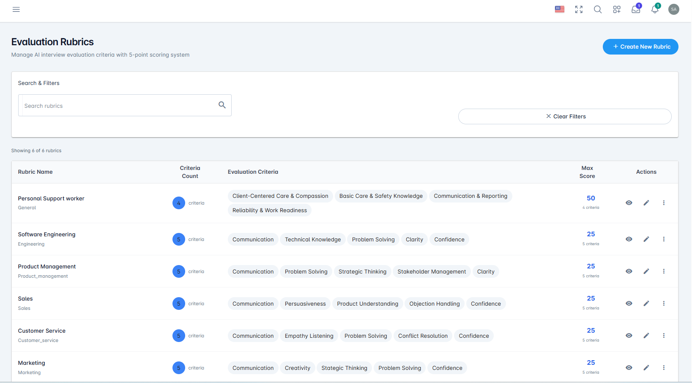
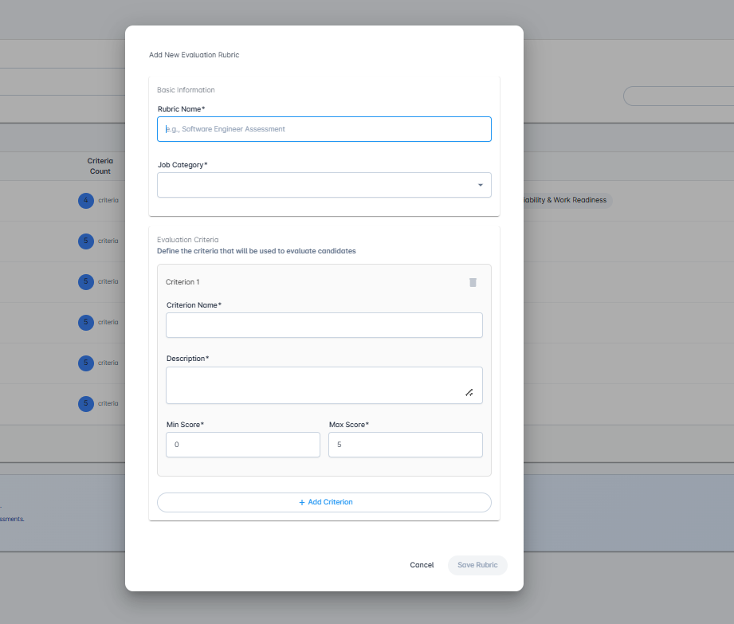
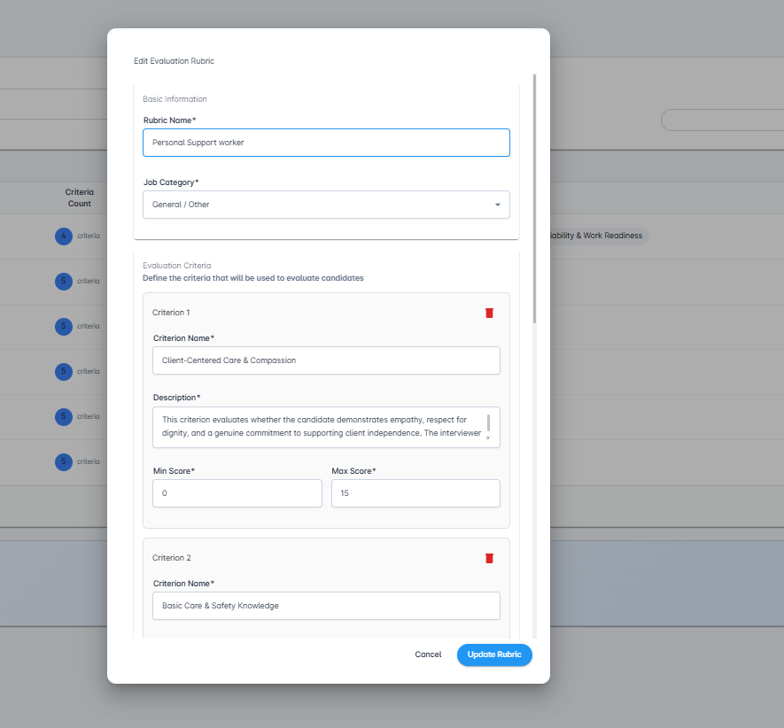

# Evaluation Rubrics

Standardized evaluation criteria used by the AI interviewer to assess and score candidate interviews.

## Overview

Evaluation Rubrics provide a systematic framework for assessing candidate interviews. The AI interviewer uses these rubrics to automatically evaluate candidate responses against your organization's specific criteria, ensuring consistent, objective, and standardized evaluation across all interviews.

**Key Benefits:**

- **Consistency**: Every candidate is evaluated against the same criteria
- **Objectivity**: Reduces bias through standardized assessment
- **Customization**: Tailor evaluation criteria to your organization's needs
- **AI-Powered Scoring**: Automated evaluation by an intelligent evaluation agent
- **Flexibility**: Adapt scoring ranges to emphasize different competencies
- **Transparency**: Clear criteria help communicate expectations

**How It Works:**

The evaluation agent analyzes candidate interview responses and automatically scores them against each criterion in your rubric. This intelligent system:
- Understands context and nuance in candidate responses
- Applies your scoring ranges consistently
- Adapts to your company's unique evaluation standards
- Provides detailed scoring for each criterion
- Generates overall assessment scores

The dashboard displays all rubrics available in your organization, organized by job category and ready to be attached to job postings.

## Dashboard Features

### Feature 1: Search and Filter

Quickly locate specific rubrics in your dashboard using the search functionality.

The page header displays "Evaluation Rubrics" with the subtitle "Manage AI interview evaluation criteria with 5-point scoring system".

The dashboard shows "Showing 6 of 6 rubrics" (or current count) to help you track your results.

**Search by Text:**

Use the **"Search rubrics"** textbox to filter rubrics:
- Free-form text search
- Type any text to filter results
- Search looks through rubric names and associated job categories
- Results update in real-time as you type
- Useful for finding rubrics for specific roles or competencies

**Filter Options:**

**Clear Filters:**

Click **"Clear Filters"** (with X icon) button on the right side to reset all search criteria and view your complete rubric library.

**Rubric Table Display:**

The dashboard displays rubrics in a table format with the following columns:

- **Rubric Name**: The name of the rubric with the job category displayed below in smaller text
  - Examples: "Personal Support worker" (General), "Software Engineering" (Engineering)
- **Criteria Count**: Blue circular badge showing the number of criteria
  - Example: "5 criteria" or "4 criteria"
  - Click to expand and view all criteria
- **Evaluation Criteria**: List of criterion names displayed as tags/badges
  - Examples: "Communication," "Technical Knowledge," "Problem Solving," "Clarity," "Confidence"
  - Multiple criteria shown inline for quick reference
- **Max Score**: The total maximum possible score (sum of all criteria max scores)
  - Displayed in blue text
  - Shows "5 criteria" count below the score
  - Examples: "50" (for weighted rubric), "25" (for standard 5-point scale)
- **Actions**: Three action icons:
  - View icon (eye) - Preview the rubric details
  - Edit icon (pencil) - Edit the rubric
  - More actions menu (three dots) - Additional options (delete, disable, etc.)

**Understanding Max Scores:**

The Max Score column helps you quickly identify rubric complexity:
- **25 points**: Standard 5-criteria rubric with 0-5 scale each (5 × 5 = 25)
- **50 points**: Weighted rubric with varied scoring (e.g., some criteria 0-10, others 0-5)
- Higher scores typically indicate more detailed or weighted evaluation criteria

### Feature 2: Create New Rubric

Build custom evaluation rubrics tailored to your organization's assessment needs.

**How to Create:**

1. Click the **+ Create New Rubric** button (blue button in top-right of dashboard)
2. A modal dialog titled **"Add New Evaluation Rubric"** opens with the rubric creation form

**Rubric Configuration:**

**Basic Information**

**Rubric Name*** (Required):
- Text input field with placeholder text: "e.g., Software Engineer Assessment"
- Enter a clear, descriptive name for the rubric
- Examples: "Software Engineering Assessment," "Sales Leadership Evaluation," "Customer Service Excellence"
- Use names that clearly indicate the role or competency being evaluated

**Job Category*** (Required):
- Dropdown field for selecting the job category
- Select the job category to which this rubric applies
- Available categories include:
  - Customer Service
  - Design & Creative
  - Engineering/Technical
  - Finance & Accounting
  - Healthcare & Personal Care
  - Hospitality, Food & Customer Service
  - Human Resources
  - Operations & Logistics
  - Product Management
  - Sales, Marketing & Business Development
  - General/Other

**Creating Evaluation Criteria:**

**Evaluation Criteria**
*Define the criteria that will be used to evaluate candidates*

The dialog displays a section for each criterion (Criterion 1, Criterion 2, etc.) with a delete icon (trash) on the right to remove criteria.

Each rubric consists of multiple criteria. For each criterion, you'll define:

**Criterion Name*** (Required):
- Text input field
- Clear, specific name for what's being evaluated
- Examples: "Technical Knowledge," "Communication Skills," "Problem Solving," "Leadership," "Cultural Fit"
- Keep names concise and descriptive

**Description*** (Required):
- Text area field with resize handle
- Detailed explanation of how candidates will be evaluated for this criterion
- Should clearly state:
  - What the criterion measures
  - What constitutes strong performance
  - What the AI should look for in responses
  - Any specific behaviors or competencies to assess
- Example: "Evaluate how clearly and effectively the candidate expresses ideas. Look for articulate responses, logical structure, and ability to explain complex concepts."

**Min Score*** (Required):
- Number input field
- Default: 0
- The minimum score a candidate can receive for this criterion
- Typically **0**, but can be higher if needed
- Use higher minimum scores when you want to emphasize that basic competency is expected

**Max Score*** (Required):
- Number input field
- Default: 5
- The maximum score for top-performing candidates
- Typically **5** for a standard 0-5 scale
- Can be adjusted to give certain criteria more weight
- Example: If "Technical Knowledge" is twice as important, set max to 10 while others are 5

**Adding Multiple Criteria:**

Click the **+ Add Criterion** button (blue link) at the bottom to create additional evaluation criteria. The dialog expands to show a new criterion section. Repeat the process for each criterion you want to include.

**Removing Criteria:**

Click the trash icon (🗑️) on the right side of a criterion header to remove that criterion from the rubric.

**Action Buttons:**

At the bottom of the dialog:
- **Cancel**: Close without saving
- **Save Rubric**: Create the rubric (enabled only when all required fields are completed)

**Best Practice - Number of Criteria:**

Evaluate against **4-6 criteria** for optimal results:
- **Too few** (1-3): May not capture full candidate profile
- **Optimal** (4-6): Comprehensive without being overwhelming
- **Too many** (7+): Can lead to evaluation fatigue and redundancy

**Common Criterion Examples:**

1. **Communication** (0-5): How clearly and effectively ideas are expressed
2. **Technical Knowledge** (0-5): Accuracy and depth of technical responses
3. **Problem Solving** (0-5): Ability to approach and solve problems logically
4. **Cultural Fit** (0-5): Alignment with company values and work style
5. **Experience Relevance** (0-5): Applicability of past experience to the role

**Weighting Criteria:**

You can adjust the importance of criteria by varying max scores:
- **Standard weight**: Use same max score (e.g., 0-5) for all criteria
- **High importance**: Increase max score (e.g., 0-10) for critical criteria
- **Lower importance**: Decrease max score (e.g., 0-3) for secondary criteria

**AI Evaluation Agent:**

Once your rubric is created, an intelligent evaluation agent automatically scores candidate interviews:
- Analyzes complete interview transcripts
- Evaluates responses against each criterion
- Assigns scores within your defined ranges
- Provides consistent, objective assessments
- Adapts to your company's specific evaluation standards

The system is extremely flexible and can adapt to any evaluation framework your organization uses.

**After Saving:**

After clicking **"Save Rubric"**, the rubric is added to your organization's rubric library and immediately becomes available for use in job postings. The dialog closes and your dashboard refreshes to show the new rubric.

### Feature 3: Edit Rubric

Modify existing rubrics to refine criteria, adjust scoring ranges, or update descriptions.

**How to Edit:**

1. Locate the rubric in the dashboard table
2. Click the **Edit icon** (pencil icon) in the Actions column of the rubric row
3. A modal dialog titled **"Edit Evaluation Rubric"** opens with the rubric details pre-filled

**Editable Sections:**

**Basic Information**

**Rubric Name*** (Required):
- Text input field showing current name
- Example shown: "Personal Support worker"
- Change the rubric title as needed

**Job Category*** (Required):
- Dropdown showing current selection
- Example shown: "General / Other"
- Update the category assignment

**Evaluation Criteria**
*Define the criteria that will be used to evaluate candidates*

The dialog shows all existing criteria with their complete details. Each criterion displays:

**Criterion 1, Criterion 2, etc.** (with delete icon 🗑️):

**Criterion Name*** (Required):
- Text input with current name
- Example shown: "Client-Centered Care & Compassion"
- Modify criterion names

**Description*** (Required):
- Text area with current description
- Example shown: "This criterion evaluates whether the candidate demonstrates empathy, respect for dignity, and a genuine commitment to supporting client independence. The interviewer..."
- Update descriptions
- Provides detailed context for AI evaluation

**Min Score*** (Required):
- Number input showing current minimum
- Example shown: "0"
- Adjust minimum scoring threshold

**Max Score*** (Required):
- Number input showing current maximum
- Example shown: "15" (showing weighted scoring)
- Modify maximum scores to adjust criterion weight

**Criterion 2** (Example):

**Criterion Name***: "Basic Core & Safety Knowledge"
- Additional criteria shown with all fields
- Each criterion can be independently edited

**Managing Criteria:**

- **Delete Criterion**: Click the trash icon (🗑️) next to criterion header to remove it
- **Add Criterion**: Scroll down to find "+ Add Criterion" button to add new criteria
- **Reorder**: Criteria are numbered sequentially (Criterion 1, 2, 3, etc.)

**Action Buttons:**

At the bottom of the dialog:
- **Cancel**: Close without saving changes
- **Update Rubric**: Save your modifications (blue button)

**Action Buttons:**

At the bottom of the dialog:
- **Cancel**: Close without saving changes
- **Update Rubric**: Save your modifications (blue button)

**After Updating:**

Click **"Update Rubric"** to save your modifications. The rubric is immediately updated in the rubric library.

**⚠️ Important Consideration - Editing Active Rubrics:**

**If interviews have already been evaluated against a rubric, the evaluations will NOT change retroactively.**

**Best Practices for Editing:**

1. **For Active Job Postings**: If a rubric is currently attached to an active job posting with applicants who have already interviewed:
   - **Do NOT edit** the existing rubric
   - **Instead**: Create a new rubric with your desired changes
   - **Reason**: Preserves consistency for candidates already evaluated

2. **When to Edit**: Only edit rubrics that:
   - Haven't been used in any interviews yet
   - Are attached to job postings with no applicants
   - Are in draft or testing phase

3. **After Job Posting Ends**: Once a job posting's deadline has passed:
   - Disable the rubric if no longer needed
   - Delete the rubric to keep your library organized
   - Archive for historical reference if required

**Disable vs. Delete:**

- **Disable**: Makes rubric inactive but preserves it for historical data
- **Delete**: Permanently removes the rubric (use with caution)

## Getting Started

### Step 1: Understand Your Evaluation Needs

Before creating rubrics:

1. **Identify Key Competencies**: What skills and traits are essential for the role?
2. **Define Success Criteria**: What does excellent performance look like?
3. **Consider Company Values**: How do organizational values factor into evaluation?
4. **Review Similar Roles**: Look at competencies for comparable positions

### Step 2: Review Existing Rubrics

Check if suitable rubrics already exist:

1. Navigate to **Evaluation Rubrics** from the left sidebar
2. Browse the dashboard to see available rubrics
3. Use search to find rubrics by job category or name
4. Review criteria in existing rubrics to see if they meet your needs

### Step 3: Create Your First Rubric

To build a custom rubric:

1. Click **Create New Rubric**
2. Enter a descriptive rubric name
3. Select the appropriate job category
4. Add 4-6 evaluation criteria
5. For each criterion:
   - Write a clear name
   - Provide detailed description for the AI
   - Set min score (typically 0)
   - Set max score (typically 5)
   - Adjust max scores to weight important criteria higher
6. Review all criteria for completeness
7. Click **Save** or **Create Rubric**

### Step 4: Attach Rubric to Job Posting

Once your rubric is ready:

1. Create or edit a job posting
2. Navigate to the **Interview Setup** section
3. Select your rubric from the **Evaluation Rubric** dropdown
4. The AI interviewer will use this rubric to evaluate all candidates
5. Save your job posting

### Step 5: Review Evaluations

After candidates complete interviews:

1. View applicant scores in the Job Postings dashboard
2. Review detailed scoring for each criterion
3. Compare candidates objectively using standardized scores
4. Use insights to make informed hiring decisions

## Best Practices

### Designing Effective Rubrics

1. **Be Specific in Descriptions**
   - Clearly articulate what each criterion measures
   - Provide context for the AI evaluation agent
   - Include examples of what constitutes strong vs. weak performance
   - Avoid vague or ambiguous language

2. **Use Appropriate Score Ranges**
   - **Standard scale**: 0-5 works well for most criteria
   - **Weighted criteria**: Use higher max scores (0-10) for critical competencies
   - **Consistent minimums**: Keep min score at 0 unless there's a specific reason to set it higher
   - **Avoid too granular**: Don't use overly wide ranges (0-100) as it reduces evaluation consistency

3. **Balance Your Criteria**
   - Include both technical and soft skills
   - Mix role-specific and general competencies
   - Ensure criteria don't overlap significantly
   - Cover all critical aspects of job performance

4. **Optimal Number of Criteria**
   - **Minimum**: 3-4 criteria for simple roles
   - **Recommended**: 4-6 criteria for most positions
   - **Maximum**: 6-8 criteria for complex senior roles
   - More criteria can lead to redundancy and evaluation complexity

### Weighting Strategies

1. **Equal Weight Approach**
   - All criteria have same min/max range (e.g., 0-5)
   - Best for: Entry-level roles, balanced skill requirements
   - Advantage: Simple, easy to understand

2. **Differentiated Weight Approach**
   - Critical criteria have higher max scores
   - Example: Technical skill (0-10), Communication (0-5), Cultural fit (0-5)
   - Best for: Specialized roles, technical positions
   - Advantage: Emphasizes most important competencies

3. **Threshold Approach**
   - Set minimum scores above 0 for essential criteria
   - Example: Technical knowledge (2-5), others (0-5)
   - Best for: Roles with non-negotiable requirements
   - Advantage: Ensures basic competency levels

### Managing Rubrics

1. **Naming Conventions**
   - Use clear, descriptive names
   - Include role level: "Senior Software Engineer - Technical"
   - Include version if iterating: "Customer Service V2"
   - Examples: "Sales Leadership Assessment," "Junior Designer Evaluation"

2. **Organization by Category**
   - Assign rubrics to appropriate job categories
   - Create role-specific rubrics within categories
   - Maintain a library of general-purpose rubrics
   - Document when and where each rubric should be used

3. **Version Control**
   - Don't edit rubrics in active use
   - Create new versions when making significant changes
   - Keep old versions until job postings conclude
   - Disable outdated rubrics rather than deleting immediately

4. **Regular Review**
   - Evaluate rubric effectiveness quarterly
   - Analyze if criteria correlate with successful hires
   - Update based on changing role requirements
   - Remove or archive rubrics no longer needed

### Integration with Hiring Process

1. **Align with Job Description**
   - Ensure rubric criteria match skills in job posting
   - Criteria should reflect actual job requirements
   - Consistency helps candidates understand expectations

2. **Calibrate with Hiring Team**
   - Share rubrics with interviewers and hiring managers
   - Ensure everyone understands evaluation criteria
   - Align on what each score level represents
   - Use rubric results alongside other evaluation methods

3. **Set Scoring Thresholds**
   - Determine minimum acceptable total scores
   - Define what constitutes "strong candidate"
   - Establish criteria for moving to next interview round
   - Document decision-making framework

4. **Combine with Custom Questions**
   - Use rubrics alongside mandatory interview questions
   - Custom questions can target specific rubric criteria
   - AI evaluates responses using both rubric and question context

### Avoiding Common Pitfalls

1. **Don't Make Rubrics Too Complex**
   - Avoid having too many criteria (7+)
   - Don't use overly detailed scoring descriptions
   - Keep it simple enough for consistent application

2. **Don't Overlap Criteria**
   - Each criterion should measure something distinct
   - Avoid redundancy (e.g., "Communication" and "Articulation")
   - If criteria seem similar, combine them

3. **Don't Forget to Update**
   - Rubrics should evolve with role requirements
   - Market changes may require new competencies
   - Technology roles especially need regular updates

4. **Don't Ignore Historical Data**
   - Preserve rubrics used for past evaluations
   - Disable rather than delete when possible
   - Maintain consistency for comparison purposes

## Tips for Success

1. **Start with Pre-built Templates**: Many organizations benefit from starting with standard rubrics and customizing them

2. **Pilot Test Your Rubrics**: Test new rubrics with a small set of interviews before rolling out broadly

3. **Analyze Scoring Patterns**: Review how candidates score across criteria to identify if adjustments are needed

4. **Get Stakeholder Input**: Involve hiring managers, team leads, and HR in rubric design

5. **Document Rationale**: Keep notes on why certain criteria and weights were chosen for future reference

6. **Create Role Families**: Develop rubric templates for similar roles (e.g., "All Engineering Roles")

7. **Train Your Team**: Ensure recruiters understand how to interpret and use rubric scores

8. **Balance Automation and Human Judgment**: Use AI scoring as one input in hiring decisions, not the only factor

9. **Respect Legal Compliance**: Ensure criteria are job-related and don't discriminate

10. **Iterate Based on Outcomes**: Track which candidates with high rubric scores become successful employees and refine accordingly

## Understanding AI Evaluation

### How the Evaluation Agent Works

The AI evaluation agent:
- **Reads Complete Transcripts**: Analyzes entire interview conversations
- **Understands Context**: Considers follow-up questions and clarifications
- **Applies Criteria**: Maps responses to each rubric criterion
- **Assigns Scores**: Provides numerical scores within your defined ranges
- **Maintains Consistency**: Evaluates all candidates using the same standards
- **Adapts to Your Framework**: Works with any scoring system you define

### What Makes a Good Criterion for AI Evaluation

Criteria that work best:
- **Observable Behaviors**: Things that can be detected in conversation
- **Clear Definitions**: Specific descriptions of what to look for
- **Measurable Outcomes**: Concrete examples in candidate responses
- **Job-Relevant**: Directly connected to role requirements

Examples:
- ✓ Good: "Technical Knowledge - Evaluates accuracy and depth of technical responses about React, Node.js, and databases"
- ✗ Less Effective: "Is a good person" (too vague, not observable)

## Related Features

- [Job Postings](./job-postings.md) - Create job postings and attach rubrics
- [Create New Job](./create-new-job.md) - Learn how to select rubrics when creating job postings
- [Interview Questions](./question.md) - Create questions that align with rubric criteria
- [Quick Create](./quick-create.md) - Quick job posting creation with rubric selection

## Need Help?

Can't find what you're looking for?
- Search our [FAQ](../faq/README.md)
- Contact support at support@aceunlock.com
- Need help designing evaluation rubrics? Our team can provide guidance and best practices
- Schedule a consultation to optimize your evaluation framework

